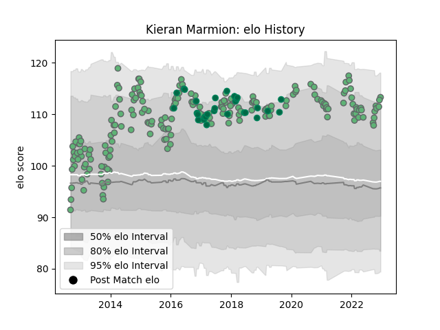

---  
layout: page  
title: Kieran Marmion  
date: 2022-12-09 13:07:43.583123  
categories: player  
---
# Kieran Marmion

## Positions: SH

## Country: Ireland

## Current elo: 113.0

## Current Percentile: 89.0

# Elo History

# Match History

| Team     |   Appearances |   Win Rate |
|:---------|--------------:|-----------:|
| Connacht |           204 |   0.477941 |
| Ireland  |            29 |   0.775862 |

| Opponent                 |   Matches |   Win Rate |
|:-------------------------|----------:|-----------:|
| Zebre                    |        19 |   0.894737 |
| Munster                  |        18 |   0.333333 |
| Ulster                   |        17 |   0.235294 |
| Ospreys                  |        16 |   0.4375   |
| Leinster                 |        16 |   0.3125   |
| Glasgow Warriors         |        15 |   0.2      |
| Edinburgh                |        14 |   0.5      |
| Scarlets                 |        14 |   0.285714 |
| Cardiff Blues            |        13 |   0.423077 |
| Dragons                  |        10 |   0.8      |
| Benetton Treviso         |        10 |   0.85     |
| Wales                    |         5 |   0.5      |
| Stade Toulousain         |         4 |   0.5      |
| Italy                    |         4 |   1        |
| Australia                |         3 |   0.666667 |
| New Zealand              |         3 |   0.666667 |
| Brive                    |         3 |   1        |
| South Africa             |         3 |   0.666667 |
| Saracens                 |         2 |   0        |
| Oyonnax                  |         2 |   1        |
| Southern Kings           |         2 |   1        |
| Worcester Warriors       |         2 |   0.75     |
| Stormers                 |         2 |   0.5      |
| Wasps                    |         2 |   0.5      |
| Scotland                 |         2 |   0.5      |
| Leicester Tigers         |         2 |   0        |
| England                  |         2 |   1        |
| La Rochelle              |         2 |   1        |
| Japan                    |         2 |   1        |
| Harlequins               |         2 |   0        |
| Bayonne                  |         2 |   1        |
| Biarritz Olympique       |         2 |   0.5      |
| Bulls                    |         2 |   0.5      |
| Gloucester Rugby         |         2 |   0        |
| Cheetahs                 |         2 |   1        |
| Montpellier Herault      |         1 |   0        |
| United States of America |         1 |   1        |
| Canada                   |         1 |   1        |
| Sharks                   |         1 |   0        |
| Exeter Chiefs            |         1 |   0        |
| Fiji                     |         1 |   1        |
| Lions                    |         1 |   1        |
| France                   |         1 |   1        |
| Grenoble                 |         1 |   0        |
| Sale Sharks              |         1 |   0        |
| RC Enisei                |         1 |   1        |
| Argentina                |         1 |   1        |