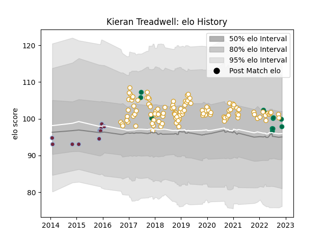

---  
layout: page  
title: Kieran Treadwell  
date: 2022-11-16 11:30:36.356938  
categories: player  
---
# Kieran Treadwell

## Positions: L

## Country: Ireland

## Current elo: 98.0

## Current Percentile: 69.0

# Elo History

# Match History

| Team       |   Appearances |   Win Rate |
|:-----------|--------------:|-----------:|
| Ulster     |           112 |   0.647321 |
| Ireland    |            12 |   0.833333 |
| Harlequins |            10 |   0.5      |

| Opponent            |   Matches |   Win Rate |
|:--------------------|----------:|-----------:|
| Connacht            |        10 |   0.5      |
| Scarlets            |         9 |   0.666667 |
| Munster             |         9 |   0.5      |
| Ospreys             |         8 |   0.75     |
| Cardiff Blues       |         8 |   0.6875   |
| Leinster            |         8 |   0.125    |
| Dragons             |         7 |   0.928571 |
| Zebre               |         6 |   0.833333 |
| Benetton Treviso    |         6 |   0.916667 |
| Edinburgh           |         6 |   0.833333 |
| Glasgow Warriors    |         6 |   0.666667 |
| Southern Kings      |         4 |   1        |
| Clermont Auvergne   |         4 |   0.5      |
| Harlequins          |         4 |   1        |
| New Zealand         |         3 |   0.666667 |
| Leicester Tigers    |         3 |   1        |
| Japan               |         2 |   1        |
| Cheetahs            |         2 |   0.75     |
| Wasps               |         2 |   0.5      |
| Stormers            |         2 |   0        |
| La Rochelle         |         2 |   0.5      |
| Calvisano           |         2 |   1        |
| New Zealand Maori   |         2 |   0.5      |
| Racing 92           |         2 |   0.5      |
| Exeter Chiefs       |         2 |   0        |
| Montpellier Herault |         2 |   0.5      |
| Fiji                |         2 |   1        |
| Bath Rugby          |         2 |   0.5      |
| Lions               |         1 |   1        |
| Saracens            |         1 |   0        |
| Bulls               |         1 |   0        |
| Scotland            |         1 |   1        |
| Sharks              |         1 |   1        |
| South Africa        |         1 |   1        |
| Bordeaux Begles     |         1 |   0        |
| Stade Toulousain    |         1 |   0        |
| Italy               |         1 |   1        |