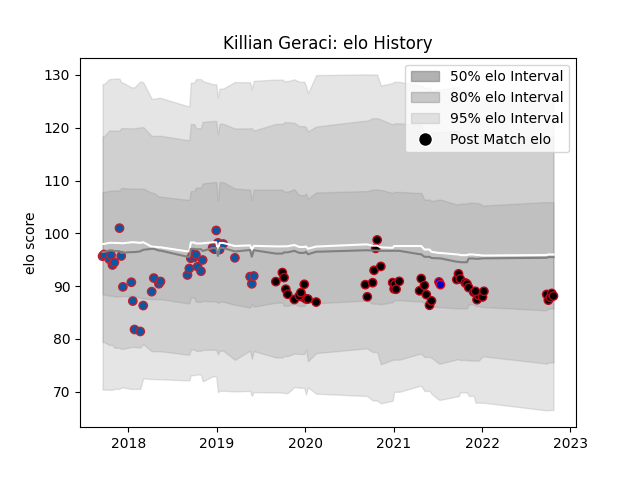

---  
layout: page  
title: Killian Geraci  
date: 2023-02-26 11:19:47.865795  
categories: player  
---
# Killian Geraci

## Positions: L

## Country: France

## Current elo: 88.0

## Current Percentile: 29.0

# Elo History

# Match History

| Team     |   Appearances |   Win Rate |
|:---------|--------------:|-----------:|
| Lyon     |            48 |   0.572917 |
| Grenoble |            37 |   0.459459 |
| France   |             2 |   0.5      |

| Opponent             |   Matches |   Win Rate |
|:---------------------|----------:|-----------:|
| Bordeaux Begles      |         7 |   0.571429 |
| Pau                  |         6 |   0.583333 |
| Castres Olympique    |         6 |   0.166667 |
| Agen                 |         5 |   0.7      |
| Racing 92            |         5 |   0.4      |
| Montpellier Herault  |         5 |   0.8      |
| Brive                |         4 |   0.5      |
| Stade Toulousain     |         4 |   0.5      |
| Stade Francais Paris |         4 |   0.25     |
| Perpignan            |         4 |   0.5      |
| Clermont Auvergne    |         4 |   0.375    |
| Benetton Treviso     |         3 |   0.333333 |
| Bayonne              |         3 |   1        |
| Biarritz Olympique   |         2 |   0.5      |
| Toulon               |         2 |   0        |
| Nevers               |         2 |   0.5      |
| Soyaux-Angouleme     |         2 |   1        |
| Aurillac             |         2 |   0.5      |
| Australia            |         2 |   0.5      |
| Lyon                 |         2 |   0        |
| Oyonnax              |         1 |   1        |
| Northampton Saints   |         1 |   0        |
| Harlequins           |         1 |   0        |
| Montauban            |         1 |   1        |
| Leinster             |         1 |   0        |
| La Rochelle          |         1 |   0        |
| Gloucester Rugby     |         1 |   1        |
| Dragons              |         1 |   1        |
| Dax                  |         1 |   1        |
| Colomiers            |         1 |   1        |
| Carcassonne          |         1 |   1        |
| Beziers              |         1 |   1        |
| Vannes               |         1 |   1        |