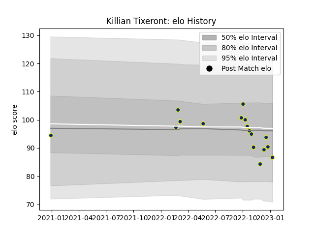

---  
layout: page  
title: Killian Tixeront  
date: 2022-12-18 16:18:42.005161  
categories: player  
---
# Killian Tixeront

## Positions: FL

## Current elo: 93.0

## Current Percentile: 36.0

# Elo History

# Match History

| Team              |   Appearances |   Win Rate |
|:------------------|--------------:|-----------:|
| Clermont Auvergne |            15 |        0.5 |

| Opponent           |   Matches |   Win Rate |
|:-------------------|----------:|-----------:|
| La Rochelle        |         2 |        0.5 |
| Lyon               |         2 |        1   |
| Perpignan          |         2 |        1   |
| Bayonne            |         1 |        0   |
| Biarritz Olympique |         1 |        1   |
| Bordeaux Begles    |         1 |        0.5 |
| Castres Olympique  |         1 |        0   |
| Leicester Tigers   |         1 |        0   |
| Racing 92          |         1 |        0   |
| Stade Toulousain   |         1 |        0   |
| Stormers           |         1 |        1   |
| Toulon             |         1 |        0   |