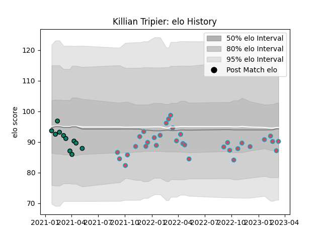

---  
layout: page  
title: Killian Tripier  
date: 2022-12-12 15:34:24.496638  
categories: player  
---
# Killian Tripier

## Positions: H

## Current elo: 97.0

## Current Percentile: 55.0

# Elo History

# Match History

| Team             |   Appearances |   Win Rate |
|:-----------------|--------------:|-----------:|
| Bourgoin-Jallieu |            17 |   0.441176 |
| Montauban        |             3 |   0.666667 |

| Opponent                   |   Matches |   Win Rate |
|:---------------------------|----------:|-----------:|
| Blagnac                    |         3 |   0.333333 |
| Nice                       |         3 |   0.666667 |
| Suresnes                   |         2 |   0.5      |
| Valence Romans Drome Rugby |         2 |   0.75     |
| Albi                       |         1 |   0        |
| Carqueiranne-Hyères        |         1 |   1        |
| Chambery                   |         1 |   0        |
| Dax                        |         1 |   1        |
| Massy                      |         1 |   0        |
| Mont-de-Marsan             |         1 |   1        |
| Nevers                     |         1 |   0        |
| Rouen                      |         1 |   1        |
| Soyaux-Angouleme           |         1 |   0        |
| US Bressane                |         1 |   0        |