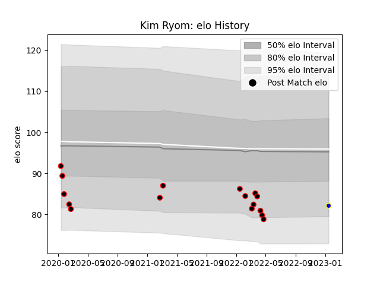

---  
layout: page  
title: Kim Ryom  
date: 2023-01-17 11:33:12.937047  
categories: player  
---
# Kim Ryom

## Positions: P

## Current elo: 82.0

## Current Percentile: 12.0

# Elo History

# Match History

| Team                            |   Appearances |   Win Rate |
|:--------------------------------|--------------:|-----------:|
| NTT Docomo Red Hurricanes Osaka |            16 |       0.25 |
| Urayasu D-Rocks                 |             1 |       1    |

| Opponent                          |   Matches |   Win Rate |
|:----------------------------------|----------:|-----------:|
| Toshiba Brave Lupus Tokyo         |         3 |        0   |
| Saitama Wild Knights              |         2 |        0   |
| Tokyo Sungoliath                  |         2 |        0   |
| Yokohama Canon Eagles             |         2 |        0.5 |
| Black Rams Tokyo                  |         1 |        1   |
| Green Rockets Tokatsu             |         1 |        1   |
| Kubota Spears Funabashi Tokyo-Bay |         1 |        0   |
| Mitsubishi Dynaboars              |         1 |        1   |
| Munakata Sanix Blues              |         1 |        0   |
| Shizuoka Blue Revs                |         1 |        0   |
| Toyota Industries Shuttles Aichi  |         1 |        1   |
| Toyota Verblitz                   |         1 |        0   |