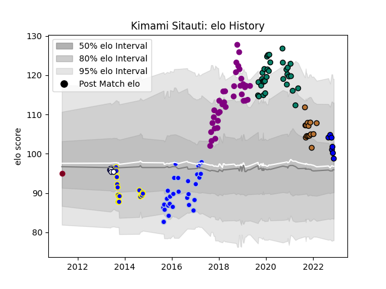

---  
layout: page  
title: Kimami Sitauti  
date: 2022-11-22 11:37:47.089095  
categories: player  
---
# Kimami Sitauti

## Positions: W, C

## Current elo: 99.0

## Current Percentile: 68.0

# Elo History

# Match History

| Team             |   Appearances |   Win Rate |
|:-----------------|--------------:|-----------:|
| Soyaux-Angouleme |            36 |   0.416667 |
| Montauban        |            32 |   0.4375   |
| Colomiers        |            29 |   0.448276 |
| Bay of Plenty    |            16 |   0.125    |
| Narbonne         |            14 |   0.142857 |
| Massy            |             7 |   0.285714 |
| Melbourne Rebels |             5 |   0.6      |
| Queensland Reds  |             1 |   0        |

| Opponent                   |   Matches |   Win Rate |
|:---------------------------|----------:|-----------:|
| Biarritz Olympique         |        11 |   0.363636 |
| Aurillac                   |         9 |   0.333333 |
| Grenoble                   |         7 |   0.357143 |
| Mont-de-Marsan             |         7 |   0.571429 |
| Carcassonne                |         7 |   0.142857 |
| Vannes                     |         7 |   0.428571 |
| Provence Rugby             |         7 |   0.857143 |
| Beziers                    |         7 |   0        |
| Montauban                  |         6 |   0.166667 |
| Perpignan                  |         6 |   0.333333 |
| Nevers                     |         5 |   0.4      |
| Soyaux-Angouleme           |         4 |   0.375    |
| Oyonnax                    |         4 |   0.75     |
| Narbonne                   |         4 |   0.5      |
| Massy                      |         4 |   0.625    |
| Colomiers                  |         4 |   0.25     |
| Bayonne                    |         4 |   0.125    |
| Rouen                      |         3 |   0.333333 |
| US Bressane                |         3 |   0.333333 |
| Bourgoin-Jallieu           |         3 |   0.333333 |
| Hawke's Bay                |         2 |   0.5      |
| Taranaki                   |         2 |   0        |
| Waikato                    |         2 |   0        |
| Southland                  |         2 |   0        |
| Roval Drome XV             |         2 |   1        |
| Northland                  |         2 |   0        |
| Otago                      |         2 |   0.5      |
| Stormers                   |         1 |   1        |
| Valence Romans Drome Rugby |         1 |   0        |
| Agen                       |         1 |   1        |
| Queensland Reds            |         1 |   0        |
| New South Wales Waratahs   |         1 |   1        |
| Albi                       |         1 |   1        |
| Hurricanes                 |         1 |   0        |
| Highlanders                |         1 |   1        |
| Counties Manukau           |         1 |   0        |
| Canterbury                 |         1 |   0        |
| Brumbies                   |         1 |   0        |
| Brive                      |         1 |   0        |
| Auckland                   |         1 |   0        |
| Wellington                 |         1 |   0        |