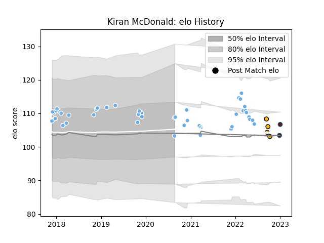

---  
layout: page  
title: Kiran McDonald  
date: 2022-12-28 12:57:07.612918  
categories: player  
---
# Kiran McDonald

## Positions: L

## Current elo: 95.0

## Current Percentile: 63.0

# Elo History

# Match History

| Team             |   Appearances |   Win Rate |
|:-----------------|--------------:|-----------:|
| Glasgow Warriors |            45 |   0.544444 |
| Wasps            |             4 |   0.25     |
| Munster          |             1 |   0        |

| Opponent            |   Matches |   Win Rate |
|:--------------------|----------:|-----------:|
| Edinburgh           |         8 |   0.5      |
| Dragons             |         5 |   0.3      |
| Cardiff Blues       |         5 |   0.8      |
| Leinster            |         4 |   0        |
| Ospreys             |         4 |   1        |
| Zebre               |         4 |   1        |
| Benetton Treviso    |         3 |   0.666667 |
| Connacht            |         2 |   1        |
| Montpellier Herault |         2 |   0        |
| Munster             |         2 |   0.5      |
| Scarlets            |         2 |   0.5      |
| Bulls               |         1 |   0        |
| Exeter Chiefs       |         1 |   0        |
| Gloucester Rugby    |         1 |   0        |
| Northampton Saints  |         1 |   0        |
| Bristol Rugby       |         1 |   0        |
| Southern Kings      |         1 |   1        |
| Stormers            |         1 |   0        |
| Ulster              |         1 |   0        |
| Bath Rugby          |         1 |   1        |