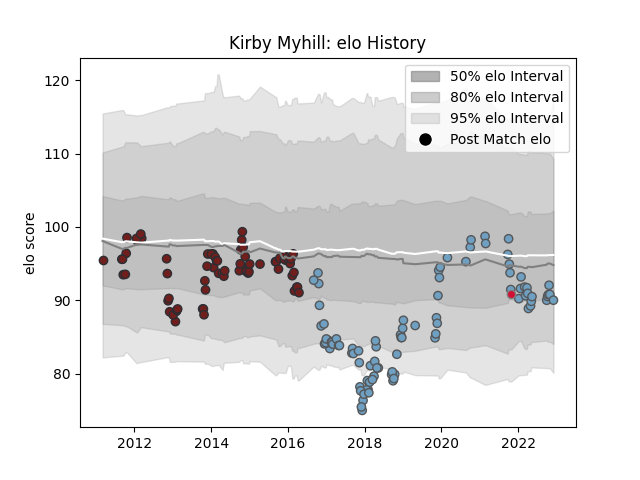

---  
layout: page  
title: Kirby Myhill  
date: 2022-12-18 16:16:38.741635  
categories: player  
---
# Kirby Myhill

## Positions: H

## Country: Wales

## Current elo: 92.0

## Current Percentile: 28.0

# Elo History

# Match History

| Team          |   Appearances |   Win Rate |
|:--------------|--------------:|-----------:|
| Cardiff Blues |            92 |   0.548913 |
| Scarlets      |            73 |   0.582192 |
| Wales         |             1 |   0        |

| Opponent           |   Matches |   Win Rate |
|:-------------------|----------:|-----------:|
| Zebre              |        13 |   0.884615 |
| Edinburgh          |        12 |   0.541667 |
| Munster            |        11 |   0.454545 |
| Dragons            |        11 |   1        |
| Ulster             |        10 |   0.45     |
| Ospreys            |        10 |   0.3      |
| Connacht           |        10 |   0.6      |
| Cardiff Blues      |         7 |   0.428571 |
| Scarlets           |         7 |   0.285714 |
| Glasgow Warriors   |         7 |   0.428571 |
| Benetton Treviso   |         6 |   1        |
| Leicester Tigers   |         5 |   0.6      |
| Leinster           |         5 |   0.4      |
| Pau                |         5 |   0.8      |
| Northampton Saints |         4 |   0        |
| Cheetahs           |         4 |   0.75     |
| Racing 92          |         3 |   0.5      |
| Harlequins         |         3 |   0.333333 |
| Sale Sharks        |         3 |   0.333333 |
| Worcester Warriors |         2 |   0        |
| Saracens           |         2 |   0        |
| Newcastle Falcons  |         2 |   0.5      |
| Lions              |         2 |   0        |
| Lyon               |         2 |   1        |
| London Irish       |         2 |   0.5      |
| Bath Rugby         |         2 |   0.5      |
| Gloucester Rugby   |         2 |   1        |
| Bulls              |         2 |   0        |
| Bristol Rugby      |         2 |   1        |
| New Zealand        |         1 |   0        |
| Exeter Chiefs      |         1 |   0        |
| Castres Olympique  |         1 |   1        |
| Calvisano          |         1 |   1        |
| Sharks             |         1 |   1        |
| Southern Kings     |         1 |   1        |
| Stormers           |         1 |   1        |
| Toulon             |         1 |   0        |
| Brive              |         1 |   1        |
| Aironi             |         1 |   1        |