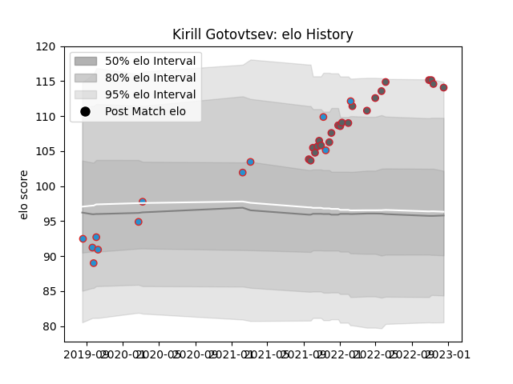

---  
layout: page  
title: Kirill Gotovtsev  
date: 2023-03-17 17:11:56.381509  
categories: player  
---
# Kirill Gotovtsev

## Positions: P

## Country: Russia

## Current elo: 110.0

## Current Percentile: 88.0

# Elo History

# Match History

| Team             |   Appearances |   Win Rate |
|:-----------------|--------------:|-----------:|
| Gloucester Rugby |            33 |   0.5      |
| Russia           |            12 |   0.333333 |

| Opponent           |   Matches |   Win Rate |
|:-------------------|----------:|-----------:|
| Exeter Chiefs      |         4 |   0.25     |
| Leicester Tigers   |         3 |   0        |
| Saracens           |         3 |   0.666667 |
| Romania            |         3 |   0.666667 |
| Harlequins         |         3 |   0.333333 |
| Newcastle Falcons  |         3 |   0.666667 |
| Bath Rugby         |         2 |   1        |
| Wasps              |         2 |   0.5      |
| Sale Sharks        |         2 |   0.5      |
| Northampton Saints |         2 |   0        |
| Leinster           |         2 |   0        |
| London Irish       |         2 |   0.75     |
| Japan              |         1 |   0        |
| Benetton Treviso   |         1 |   1        |
| Netherlands        |         1 |   1        |
| Italy              |         1 |   0        |
| Ireland            |         1 |   0        |
| Portugal           |         1 |   1        |
| Georgia            |         1 |   0        |
| Dragons            |         1 |   1        |
| Samoa              |         1 |   0        |
| Bristol Rugby      |         1 |   1        |
| Scotland           |         1 |   0        |
| Spain              |         1 |   0        |
| Bordeaux Begles    |         1 |   1        |
| Worcester Warriors |         1 |   1        |