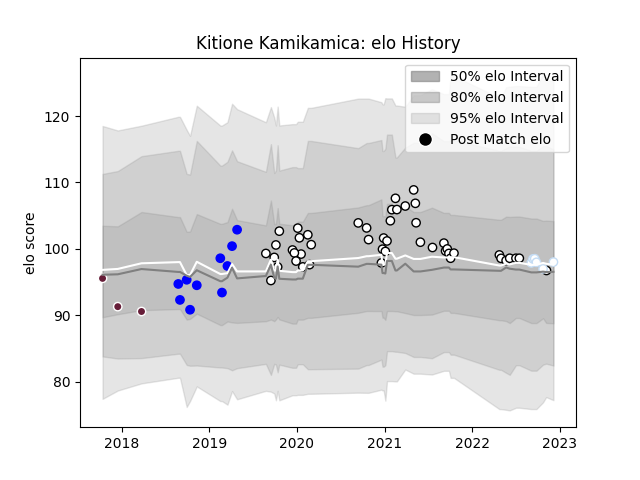

---  
layout: page  
title: Kitione Kamikamica  
date: 2022-12-09 13:21:30.541129  
categories: player  
---
# Kitione Kamikamica

## Positions: N8, FL

## Country: Fiji

## Current elo: 98.0

## Current Percentile: 53.0

# Elo History

# Match History

| Team            |   Appearances |   Win Rate |
|:----------------|--------------:|-----------:|
| Brive           |            43 |   0.453488 |
| Vannes          |            10 |   0.5      |
| Racing 92       |             6 |   0.666667 |
| Fiji            |             4 |   0.25     |
| Bordeaux Begles |             3 |   0.666667 |

| Opponent             |   Matches |   Win Rate |
|:---------------------|----------:|-----------:|
| Montpellier Herault  |         5 |   0.4      |
| Stade Francais Paris |         5 |   0.6      |
| Lyon                 |         5 |   0.6      |
| Toulon               |         4 |   0.75     |
| Stade Toulousain     |         4 |   0.25     |
| Bordeaux Begles      |         4 |   0.5      |
| La Rochelle          |         4 |   0.25     |
| Pau                  |         4 |   0.75     |
| Castres Olympique    |         3 |   0.666667 |
| Bayonne              |         3 |   0.166667 |
| Agen                 |         2 |   0.5      |
| RC Enisei            |         2 |   1        |
| Perpignan            |         2 |   0.5      |
| Oyonnax              |         2 |   0.5      |
| Zebre                |         2 |   0.5      |
| Montauban            |         1 |   1        |
| New Zealand          |         1 |   0        |
| Mont-de-Marsan       |         1 |   0        |
| Massy                |         1 |   1        |
| Clermont Auvergne    |         1 |   0        |
| Brive                |         1 |   0        |
| Racing 92            |         1 |   0        |
| Samoa                |         1 |   0        |
| Scotland             |         1 |   0        |
| Soyaux-Angouleme     |         1 |   0        |
| Bristol Rugby        |         1 |   0        |
| Biarritz Olympique   |         1 |   1        |
| Tonga                |         1 |   1        |
| Beziers              |         1 |   0        |
| Nevers               |         1 |   1        |