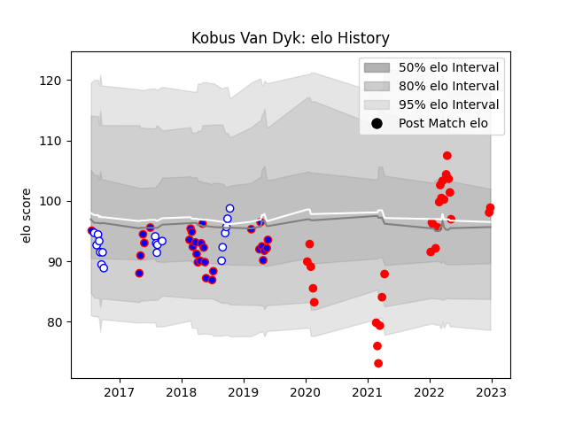

---  
layout: page  
title: Kobus Van Dyk  
date: 2023-02-02 18:55:18.456121  
categories: player  
---
# Kobus Van Dyk

## Positions: FL, N8

## Current elo: 108.0

## Current Percentile: 77.0

# Elo History

# Match History

| Team                  |   Appearances |   Win Rate |
|:----------------------|--------------:|-----------:|
| Yokohama Canon Eagles |            32 |   0.546875 |
| Stormers              |            29 |   0.396552 |
| Western Province      |            19 |   0.736842 |

| Opponent                          |   Matches |   Win Rate |
|:----------------------------------|----------:|-----------:|
| Kobelco Kobe Steelers             |         5 |   0.4      |
| Saitama Wild Knights              |         5 |   0        |
| Green Rockets Tokatsu             |         5 |   1        |
| Bulls                             |         4 |   0.5      |
| Free State Cheetahs               |         4 |   0.5      |
| Blue Bulls                        |         3 |   0.666667 |
| Jaguares                          |         3 |   0.333333 |
| Highlanders                       |         3 |   0.333333 |
| Griquas                           |         3 |   0.666667 |
| Kubota Spears Funabashi Tokyo-Bay |         3 |   0.5      |
| Pumas                             |         3 |   1        |
| Sharks                            |         3 |   0.333333 |
| NTT Docomo Red Hurricanes Osaka   |         2 |   0.5      |
| Queensland Reds                   |         2 |   0.5      |
| Melbourne Rebels                  |         2 |   1        |
| Shizuoka Blue Revs                |         2 |   1        |
| Lions                             |         2 |   0        |
| Tokyo Sungoliath                  |         2 |   0        |
| Natal Sharks                      |         2 |   1        |
| Black Rams Tokyo                  |         2 |   1        |
| Golden Lions                      |         2 |   0.5      |
| Crusaders                         |         2 |   0.25     |
| Hurricanes                        |         1 |   0        |
| Brumbies                          |         1 |   0        |
| Toyota Verblitz                   |         1 |   1        |
| Toshiba Brave Lupus Tokyo         |         1 |   0        |
| Blues                             |         1 |   1        |
| Sunwolves                         |         1 |   0        |
| Southern Kings                    |         1 |   1        |
| Boland Cavaliers                  |         1 |   1        |
| Cheetahs                          |         1 |   1        |
| Hanazono Kintetsu Liners          |         1 |   1        |
| Chiefs                            |         1 |   0        |
| New South Wales Waratahs          |         1 |   0        |
| Eastern Province Kings            |         1 |   1        |
| Munakata Sanix Blues              |         1 |   1        |
| Mie Honda Heat                    |         1 |   0        |
| Urayasu D-Rocks                   |         1 |   1        |