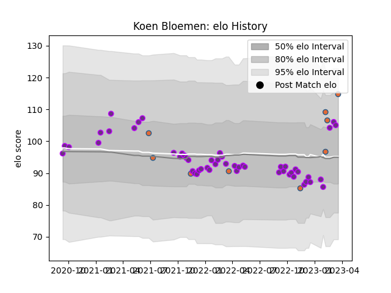

---  
layout: page  
title: Koen Bloemen  
date: 2023-03-17 17:29:39.150586  
categories: player  
---
# Koen Bloemen

## Positions: L

## Country: Netherlands

## Current elo: 105.0

## Current Percentile: 79.0

# Elo History

# Match History

| Team        |   Appearances |   Win Rate |
|:------------|--------------:|-----------:|
| US Bressane |            52 |   0.576923 |
| Netherlands |             8 |   0        |

| Opponent                   |   Matches |   Win Rate |
|:---------------------------|----------:|-----------:|
| Narbonne                   |         5 |   0.8      |
| Blagnac                    |         4 |   0.75     |
| Tarbes                     |         3 |   0.666667 |
| Agen                       |         2 |   1        |
| Dax                        |         2 |   0        |
| Suresnes                   |         2 |   1        |
| Spain                      |         2 |   0        |
| Romania                    |         2 |   0        |
| Provence Rugby             |         2 |   0.25     |
| Nice                       |         2 |   0.5      |
| Nevers                     |         2 |   0        |
| Georgia                    |         2 |   0        |
| Grenoble                   |         2 |   0.5      |
| Colomiers                  |         2 |   0.5      |
| Chambery                   |         2 |   1        |
| Aurillac                   |         2 |   0.5      |
| Bayonne                    |         2 |   0        |
| Beziers                    |         2 |   1        |
| Carqueiranne-Hyères        |         2 |   0.5      |
| Vannes                     |         2 |   0        |
| Cognac Saint Jean d'Angély |         2 |   1        |
| Montauban                  |         1 |   0.5      |
| Carcassonne                |         1 |   0        |
| Oyonnax                    |         1 |   0        |
| Dijon                      |         1 |   1        |
| Canada                     |         1 |   0        |
| Rennes                     |         1 |   1        |
| Bourgoin-Jallieu           |         1 |   1        |
| Rouen                      |         1 |   1        |
| Mont-de-Marsan             |         1 |   0        |
| Albi                       |         1 |   0        |
| Valence Romans Drome Rugby |         1 |   1        |
| Portugal                   |         1 |   0        |