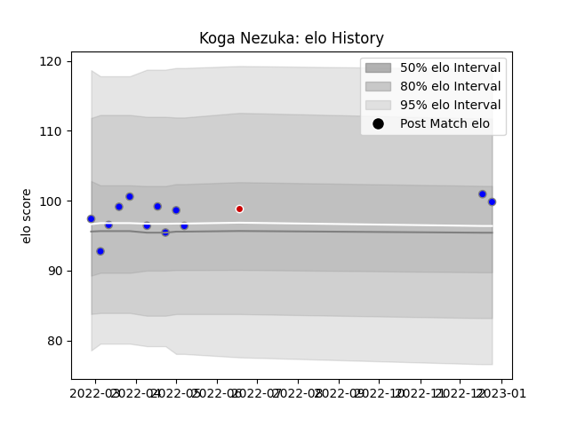

---  
layout: page  
title: Koga Nezuka  
date: 2023-02-02 19:00:32.254112  
categories: player  
---
# Koga Nezuka

## Positions: W

## Country: Japan

## Current elo: 96.0

## Current Percentile: 55.0

# Elo History

# Match History

| Team                              |   Appearances |   Win Rate |
|:----------------------------------|--------------:|-----------:|
| Kubota Spears Funabashi Tokyo-Bay |            16 |    0.78125 |
| Japan                             |             1 |    1       |

| Opponent                        |   Matches |   Win Rate |
|:--------------------------------|----------:|-----------:|
| Green Rockets Tokatsu           |         2 |       1    |
| Kobelco Kobe Steelers           |         2 |       1    |
| Tokyo Sungoliath                |         2 |       0.5  |
| Yokohama Canon Eagles           |         2 |       0.25 |
| Black Rams Tokyo                |         1 |       1    |
| Hanazono Kintetsu Liners        |         1 |       1    |
| NTT Docomo Red Hurricanes Osaka |         1 |       1    |
| Saitama Wild Knights            |         1 |       0    |
| Shizuoka Blue Revs              |         1 |       1    |
| Toshiba Brave Lupus Tokyo       |         1 |       1    |
| Toyota Verblitz                 |         1 |       1    |
| Urayasu D-Rocks                 |         1 |       1    |
| Uruguay                         |         1 |       1    |