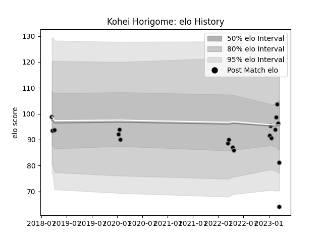

---  
layout: page  
title: Kohei Horigome  
date: 2023-01-13 11:28:36.211477  
categories: player  
---
# Kohei Horigome

## Positions: FH, C

## Current elo: 89.0

## Current Percentile: 17.0

# Elo History

# Match History

| Team             |   Appearances |   Win Rate |
|:-----------------|--------------:|-----------:|
| Black Rams Tokyo |            11 |   0.363636 |

| Opponent                          |   Matches |   Win Rate |
|:----------------------------------|----------:|-----------:|
| Coca-Cola Red Sparks              |         1 |          1 |
| Kobelco Kobe Steelers             |         1 |          0 |
| Kubota Spears Funabashi Tokyo-Bay |         1 |          0 |
| Mie Honda Heat                    |         1 |          0 |
| Munakata Sanix Blues              |         1 |          1 |
| Saitama Wild Knights              |         1 |          0 |
| Shizuoka Blue Revs                |         1 |          0 |
| Tokyo Sungoliath                  |         1 |          0 |
| Toshiba Brave Lupus Tokyo         |         1 |          0 |
| Toyota Verblitz                   |         1 |          1 |
| Yokohama Canon Eagles             |         1 |          1 |