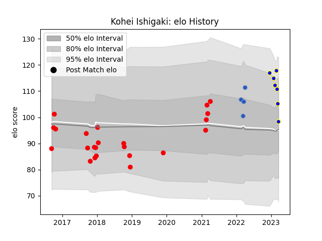

---  
layout: page  
title: Kohei Ishigaki  
date: 2022-12-18 16:39:28.118377  
categories: player  
---
# Kohei Ishigaki

## Positions: W, C

## Current elo: 105.0

## Current Percentile: 82.0

# Elo History

# Match History

| Team                 |   Appearances |   Win Rate |
|:---------------------|--------------:|-----------:|
| Coca-Cola Red Sparks |            13 |   0.384615 |
| Munakata Sanix Blues |             3 |   1        |
| Kamaishi Seawaves    |             1 |   0        |

| Opponent                          |   Matches |   Win Rate |
|:----------------------------------|----------:|-----------:|
| Kurita Water Gush                 |         2 |          1 |
| Kyuden Voltex                     |         2 |          1 |
| Toyota Verblitz                   |         2 |          0 |
| Black Rams Tokyo                  |         1 |          0 |
| Chugoku Red Regulions             |         1 |          1 |
| Hino Red Dolphins                 |         1 |          0 |
| Kobelco Kobe Steelers             |         1 |          0 |
| Kubota Spears Funabashi Tokyo-Bay |         1 |          0 |
| Mie Honda Heat                    |         1 |          1 |
| Shimizu Blue Sharks               |         1 |          1 |
| Shizuoka Blue Revs                |         1 |          0 |
| Skyactivs Hiroshima               |         1 |          1 |
| Toyota Industries Shuttles Aichi  |         1 |          0 |
| Urayasu D-Rocks                   |         1 |          0 |