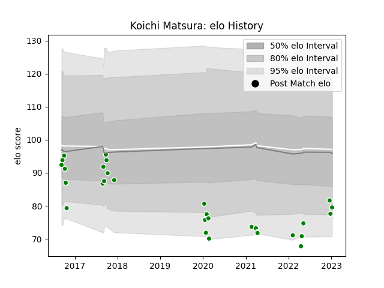

---  
layout: page  
title: Koichi Matsura  
date: 2023-02-02 19:12:40.547452  
categories: player  
---
# Koichi Matsura

## Positions: C, W

## Current elo: 71.0

## Current Percentile: 7.0

# Elo History

# Match History

| Team                  |   Appearances |   Win Rate |
|:----------------------|--------------:|-----------:|
| Green Rockets Tokatsu |            33 |    0.19697 |

| Opponent                          |   Matches |   Win Rate |
|:----------------------------------|----------:|-----------:|
| Kobelco Kobe Steelers             |         4 |   0        |
| Yokohama Canon Eagles             |         4 |   0        |
| Black Rams Tokyo                  |         3 |   0        |
| Kubota Spears Funabashi Tokyo-Bay |         3 |   0.166667 |
| Saitama Wild Knights              |         3 |   0        |
| Tokyo Sungoliath                  |         3 |   0        |
| Munakata Sanix Blues              |         2 |   0.5      |
| Shizuoka Blue Revs                |         2 |   0        |
| Toyota Industries Shuttles Aichi  |         2 |   1        |
| Urayasu D-Rocks                   |         2 |   0        |
| Coca-Cola Red Sparks              |         1 |   1        |
| Hanazono Kintetsu Liners          |         1 |   1        |
| Hino Red Dolphins                 |         1 |   0        |
| Mitsubishi Dynaboars              |         1 |   0        |
| Toyota Verblitz                   |         1 |   1        |