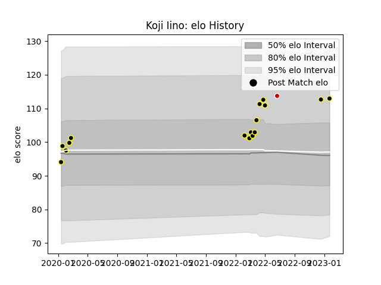

---  
layout: page  
title: Koji Iino  
date: 2023-03-21 18:17:47.202066  
categories: player  
---
# Koji Iino

Last updated: 2023-03-21
## Positions: FL

## Country: Japan

## Current elo: 106.0

## Current Percentile: 74.0

# Elo History

# Match History

| Team             |   Appearances |   Win Rate |
|:-----------------|--------------:|-----------:|
| Tokyo Sungoliath |            26 |   0.730769 |
| Japan            |             1 |   1        |

| Opponent                          |   Matches |   Win Rate |
|:----------------------------------|----------:|-----------:|
| Kobelco Kobe Steelers             |         3 |   0.333333 |
| Kubota Spears Funabashi Tokyo-Bay |         3 |   1        |
| Saitama Wild Knights              |         3 |   0        |
| Toshiba Brave Lupus Tokyo         |         3 |   0.333333 |
| Green Rockets Tokatsu             |         2 |   1        |
| Hanazono Kintetsu Liners          |         2 |   1        |
| Hino Red Dolphins                 |         2 |   1        |
| NTT Docomo Red Hurricanes Osaka   |         2 |   1        |
| Urayasu D-Rocks                   |         2 |   1        |
| Black Rams Tokyo                  |         1 |   1        |
| Mitsubishi Dynaboars              |         1 |   1        |
| Toyota Verblitz                   |         1 |   1        |
| Uruguay                           |         1 |   1        |
| Yokohama Canon Eagles             |         1 |   1        |