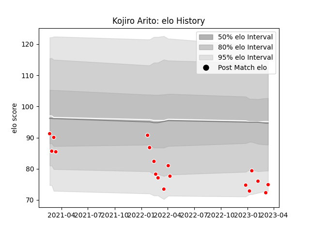

---  
layout: page  
title: Kojiro Arito  
date: 2023-03-21 18:09:35.708293  
categories: player  
---
# Kojiro Arito

Last updated: 2023-03-21
## Positions: P

## Current elo: 75.0

## Current Percentile: 5.0

# Elo History

# Match History

| Team                  |   Appearances |   Win Rate |
|:----------------------|--------------:|-----------:|
| Chugoku Red Regulions |            18 |   0.111111 |

| Opponent                         |   Matches |   Win Rate |
|:---------------------------------|----------:|-----------:|
| Kurita Water Gush                |         4 |        0.5 |
| Kyuden Voltex                    |         4 |        0   |
| Munakata Sanix Blues             |         2 |        0   |
| Shimizu Blue Sharks              |         2 |        0   |
| Skyactivs Hiroshima              |         2 |        0   |
| Toyota Industries Shuttles Aichi |         2 |        0   |
| Coca-Cola Red Sparks             |         1 |        0   |
| NTT Docomo Red Hurricanes Osaka  |         1 |        0   |