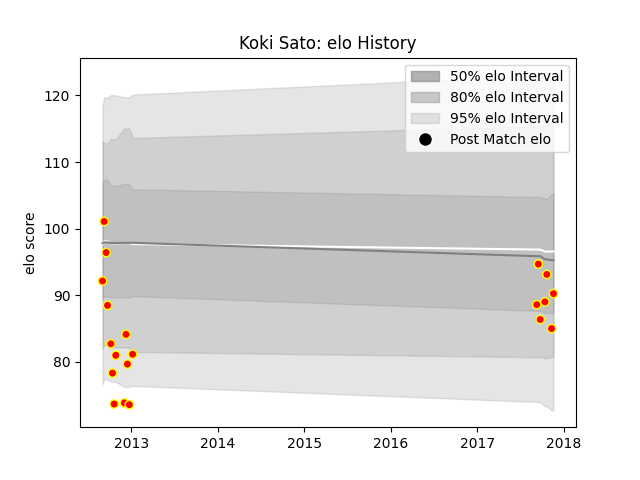

---  
layout: page  
title: Koki Sato  
date: 2023-03-21 18:22:23.444121  
categories: player  
---
# Koki Sato

Last updated: 2023-03-21
## Positions: H

## Current elo: 95.0

## Current Percentile: 32.0

# Elo History

# Match History

| Team          |   Appearances |   Win Rate |
|:--------------|--------------:|-----------:|
| Kyuden Voltex |            26 |   0.230769 |

| Opponent                        |   Matches |   Win Rate |
|:--------------------------------|----------:|-----------:|
| Urayasu D-Rocks                 |         2 |        0   |
| Green Rockets Tokatsu           |         2 |        0   |
| Toyota Verblitz                 |         2 |        0   |
| Tokyo Sungoliath                |         2 |        0   |
| Kobelco Kobe Steelers           |         2 |        0   |
| NTT Docomo Red Hurricanes Osaka |         2 |        0.5 |
| Black Rams Tokyo                |         1 |        1   |
| Munakata Sanix Blues            |         1 |        0   |
| Toshiba Brave Lupus Tokyo       |         1 |        0   |
| Shizuoka Blue Revs              |         1 |        0   |
| Saitama Wild Knights            |         1 |        0   |
| Mitsubishi Dynaboars            |         1 |        0   |
| Chubu Electric Power            |         1 |        1   |
| Mie Honda Heat                  |         1 |        0   |
| Mazda Blue Zoomers              |         1 |        1   |
| Kamaishi Seawaves               |         1 |        1   |
| Hino Red Dolphins               |         1 |        0   |
| Hanazono Kintetsu Liners        |         1 |        0   |
| Chugoku Red Regulions           |         1 |        1   |
| Yokohama Canon Eagles           |         1 |        0   |