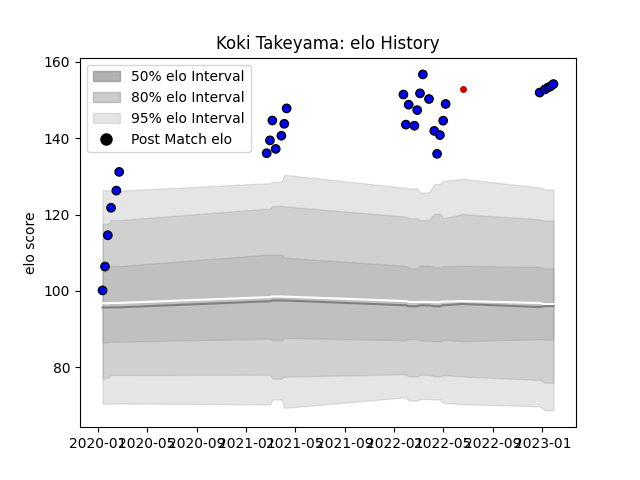

---  
layout: page  
title: Koki Takeyama  
date: 2023-01-13 11:23:25.669796  
categories: player  
---
# Koki Takeyama

## Positions: W

## Country: Japan

## Current elo: 153.0

## Current Percentile: 99.0

# Elo History

# Match History

| Team                 |   Appearances |   Win Rate |
|:---------------------|--------------:|-----------:|
| Saitama Wild Knights |            28 |   0.982143 |
| Japan                |             1 |   1        |

| Opponent                          |   Matches |   Win Rate |
|:----------------------------------|----------:|-----------:|
| Yokohama Canon Eagles             |         4 |   1        |
| Kobelco Kobe Steelers             |         3 |   0.833333 |
| NTT Docomo Red Hurricanes Osaka   |         3 |   1        |
| Shizuoka Blue Revs                |         3 |   1        |
| Green Rockets Tokatsu             |         2 |   1        |
| Kubota Spears Funabashi Tokyo-Bay |         2 |   1        |
| Mitsubishi Dynaboars              |         2 |   1        |
| Toshiba Brave Lupus Tokyo         |         2 |   1        |
| Toyota Verblitz                   |         2 |   1        |
| Urayasu D-Rocks                   |         2 |   1        |
| Black Rams Tokyo                  |         1 |   1        |
| Hino Red Dolphins                 |         1 |   1        |
| Tokyo Sungoliath                  |         1 |   1        |
| Uruguay                           |         1 |   1        |