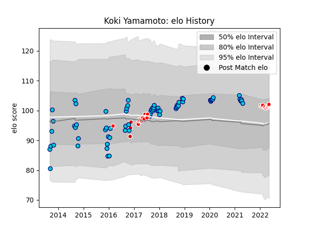

---  
layout: page  
title: Koki Yamamoto  
date: 2023-02-02 18:56:04.399648  
categories: player  
---
# Koki Yamamoto

## Positions: P

## Country: Japan

## Current elo: 99.0

## Current Percentile: 59.0

# Elo History

# Match History

| Team                  |   Appearances |   Win Rate |
|:----------------------|--------------:|-----------:|
| Shizuoka Blue Revs    |            49 |   0.785714 |
| Kobelco Kobe Steelers |            15 |   0.4      |
| Sunwolves             |            15 |   0.133333 |
| Japan                 |             6 |   0.333333 |

| Opponent                          |   Matches |   Win Rate |
|:----------------------------------|----------:|-----------:|
| Yokohama Canon Eagles             |         7 |   0.714286 |
| Saitama Wild Knights              |         7 |   0.214286 |
| Kubota Spears Funabashi Tokyo-Bay |         6 |   0.666667 |
| Green Rockets Tokatsu             |         5 |   1        |
| Black Rams Tokyo                  |         5 |   1        |
| Toshiba Brave Lupus Tokyo         |         5 |   0.6      |
| Urayasu D-Rocks                   |         4 |   0.75     |
| Kobelco Kobe Steelers             |         4 |   0        |
| Coca-Cola Red Sparks              |         4 |   1        |
| Toyota Verblitz                   |         3 |   0.666667 |
| NTT Docomo Red Hurricanes Osaka   |         3 |   1        |
| Toyota Industries Shuttles Aichi  |         2 |   1        |
| Bulls                             |         2 |   0.5      |
| Tokyo Sungoliath                  |         2 |   0        |
| Stormers                          |         2 |   0        |
| Lions                             |         2 |   0        |
| Mie Honda Heat                    |         2 |   1        |
| Cheetahs                          |         2 |   0        |
| Munakata Sanix Blues              |         2 |   1        |
| Crusaders                         |         1 |   0        |
| Romania                           |         1 |   1        |
| Wales                             |         1 |   0        |
| Blues                             |         1 |   1        |
| Southern Kings                    |         1 |   0        |
| Mitsubishi Dynaboars              |         1 |   1        |
| England                           |         1 |   0        |
| Chiefs                            |         1 |   0        |
| Australia                         |         1 |   0        |
| Jaguares                          |         1 |   0        |
| Hurricanes                        |         1 |   0        |
| Hino Red Dolphins                 |         1 |   1        |
| Highlanders                       |         1 |   0        |
| Hanazono Kintetsu Liners          |         1 |   1        |
| Georgia                           |         1 |   1        |
| Argentina                         |         1 |   0        |