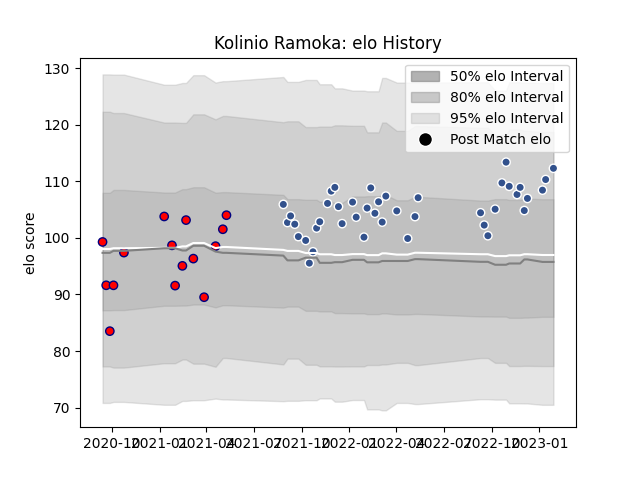

---  
layout: page  
title: Kolinio Ramoka  
date: 2022-11-22 11:29:06.928805  
categories: player  
---
# Kolinio Ramoka

## Positions: C

## Current elo: 97.0

## Current Percentile: 63.0

# Elo History

# Match History

| Team                       |   Appearances |   Win Rate |
|:---------------------------|--------------:|-----------:|
| Agen                       |            29 |   0.362069 |
| Cognac Saint Jean d'Angély |            15 |   0.433333 |

| Opponent         |   Matches |   Win Rate |
|:-----------------|----------:|-----------:|
| Mont-de-Marsan   |         3 |   0.333333 |
| Narbonne         |         3 |   0.333333 |
| Vannes           |         3 |   0.666667 |
| Beziers          |         2 |   0        |
| Aurillac         |         2 |   0.5      |
| Tarbes           |         2 |   0.25     |
| Rouen            |         2 |   0.5      |
| Provence Rugby   |         2 |   0.5      |
| Oyonnax          |         2 |   0        |
| Nevers           |         2 |   0.5      |
| Blagnac          |         2 |   0        |
| Montauban        |         2 |   0        |
| Albi             |         2 |   0.5      |
| Dijon            |         2 |   1        |
| Colomiers        |         2 |   0        |
| Carcassonne      |         2 |   0.5      |
| Massy            |         1 |   0        |
| Grenoble         |         1 |   1        |
| Nice             |         1 |   0        |
| Dax              |         1 |   1        |
| Soyaux-Angouleme |         1 |   0        |
| Suresnes         |         1 |   1        |
| Bourgoin-Jallieu |         1 |   1        |
| US Bressane      |         1 |   0        |
| Bayonne          |         1 |   0.5      |