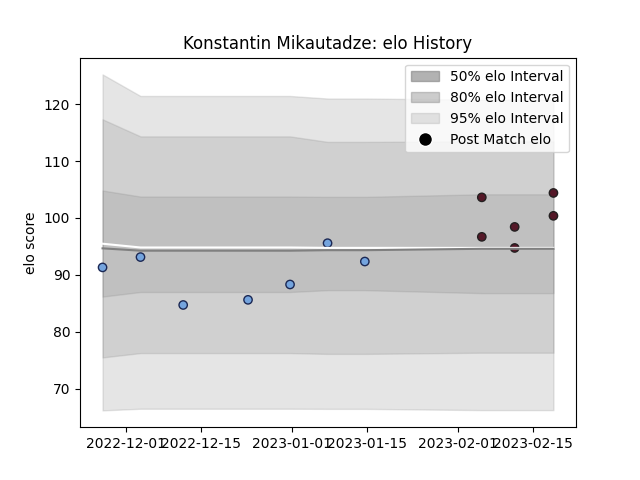

---  
layout: page  
title: Konstantin Mikautadze  
date: 2023-02-24 02:35:12.157682  
categories: player  
---
# Konstantin Mikautadze

## Positions: L

## Country: Georgia

## Current elo: 104.0

## Current Percentile: 61.0

# Elo History

# Match History

| Team    |   Appearances |   Win Rate |
|:--------|--------------:|-----------:|
| Bayonne |             7 |   0.357143 |
| Georgia |             6 |   1        |

| Opponent            |   Matches |   Win Rate |
|:--------------------|----------:|-----------:|
| Germany             |         2 |        1   |
| Netherlands         |         2 |        1   |
| Spain               |         2 |        1   |
| Benetton Treviso    |         1 |        0   |
| Bordeaux Begles     |         1 |        0   |
| Lyon                |         1 |        1   |
| Montpellier Herault |         1 |        0   |
| Pau                 |         1 |        0.5 |
| Scarlets            |         1 |        0   |
| Toulon              |         1 |        1   |