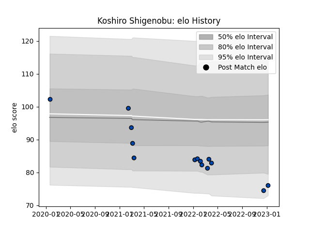

---  
layout: page  
title: Koshiro Shigenobu  
date: 2023-03-21 18:22:05.926426  
categories: player  
---
# Koshiro Shigenobu

Last updated: 2023-03-21
## Positions: P

## Current elo: 86.0

## Current Percentile: 24.0

# Elo History

# Match History

| Team                |   Appearances |   Win Rate |
|:--------------------|--------------:|-----------:|
| Skyactivs Hiroshima |            21 |   0.190476 |
| Mazda Blue Zoomers  |             1 |   1        |

| Opponent                         |   Matches |   Win Rate |
|:---------------------------------|----------:|-----------:|
| Kyuden Voltex                    |         5 |   0.2      |
| Kamaishi Seawaves                |         3 |   0.333333 |
| NTT Docomo Red Hurricanes Osaka  |         3 |   0        |
| Chugoku Red Regulions            |         2 |   1        |
| Kurita Water Gush                |         2 |   0.5      |
| Mitsubishi Dynaboars             |         2 |   0        |
| Coca-Cola Red Sparks             |         1 |   0        |
| Hanazono Kintetsu Liners         |         1 |   0        |
| Hino Red Dolphins                |         1 |   0        |
| Mie Honda Heat                   |         1 |   0        |
| Toyota Industries Shuttles Aichi |         1 |   0        |