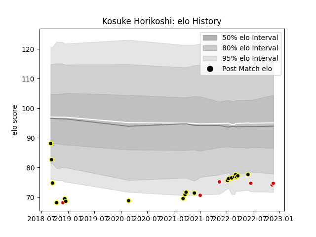

---  
layout: page  
title: Kosuke Horikoshi  
date: 2023-03-09 10:09:34.237170  
categories: player  
---
# Kosuke Horikoshi

## Positions: H, P

## Country: Japan

## Current elo: 75.0

## Current Percentile: 7.0

# Elo History

# Match History

| Team             |   Appearances |   Win Rate |
|:-----------------|--------------:|-----------:|
| Tokyo Sungoliath |            19 |   0.736842 |
| Japan            |             6 |   0.5      |

| Opponent                          |   Matches |   Win Rate |
|:----------------------------------|----------:|-----------:|
| Kobelco Kobe Steelers             |         3 |   0.333333 |
| Saitama Wild Knights              |         3 |   0        |
| Toyota Verblitz                   |         3 |   1        |
| Munakata Sanix Blues              |         2 |   1        |
| Toshiba Brave Lupus Tokyo         |         2 |   1        |
| Urayasu D-Rocks                   |         2 |   1        |
| England                           |         1 |   0        |
| France                            |         1 |   0        |
| Hino Red Dolphins                 |         1 |   1        |
| Ireland                           |         1 |   0        |
| Kubota Spears Funabashi Tokyo-Bay |         1 |   1        |
| NTT Docomo Red Hurricanes Osaka   |         1 |   1        |
| Portugal                          |         1 |   1        |
| Russia                            |         1 |   1        |
| Shizuoka Blue Revs                |         1 |   1        |
| Uruguay                           |         1 |   1        |