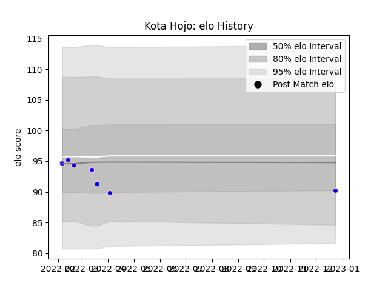

---  
layout: page  
title: Kota Hojo  
date: 2023-02-02 19:08:04.465076  
categories: player  
---
# Kota Hojo

## Positions: H

## Current elo: 89.0

## Current Percentile: 39.0

# Elo History

# Match History

| Team              |   Appearances |   Win Rate |
|:------------------|--------------:|-----------:|
| Kurita Water Gush |            10 |        0.3 |

| Opponent                         |   Matches |   Win Rate |
|:---------------------------------|----------:|-----------:|
| Chugoku Red Regulions            |         3 |   0.333333 |
| Munakata Sanix Blues             |         2 |   0        |
| Kyuden Voltex                    |         1 |   0        |
| NTT Docomo Red Hurricanes Osaka  |         1 |   1        |
| Shimizu Blue Sharks              |         1 |   0        |
| Skyactivs Hiroshima              |         1 |   1        |
| Toyota Industries Shuttles Aichi |         1 |   0        |