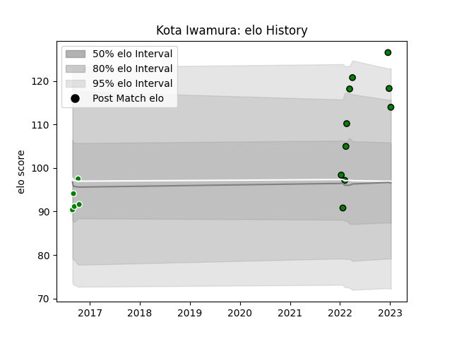

---  
layout: page  
title: Kota Iwamura  
date: 2023-02-02 18:43:27.796932  
categories: player  
---
# Kota Iwamura

## Positions: SH

## Current elo: 111.0

## Current Percentile: 88.0

# Elo History

# Match History

| Team                 |   Appearances |   Win Rate |
|:---------------------|--------------:|-----------:|
| Mitsubishi Dynaboars |            13 |   0.807692 |
| Toyota Verblitz      |             5 |   0.8      |

| Opponent                          |   Matches |   Win Rate |
|:----------------------------------|----------:|-----------:|
| Hanazono Kintetsu Liners          |         3 |        1   |
| Mie Honda Heat                    |         2 |        1   |
| Skyactivs Hiroshima               |         2 |        1   |
| Black Rams Tokyo                  |         1 |        1   |
| Hino Red Dolphins                 |         1 |        1   |
| Kamaishi Seawaves                 |         1 |        1   |
| Kubota Spears Funabashi Tokyo-Bay |         1 |        1   |
| Saitama Wild Knights              |         1 |        0   |
| Shizuoka Blue Revs                |         1 |        0.5 |
| Tokyo Sungoliath                  |         1 |        0   |
| Toshiba Brave Lupus Tokyo         |         1 |        1   |
| Toyota Industries Shuttles Aichi  |         1 |        1   |
| Toyota Verblitz                   |         1 |        1   |
| Urayasu D-Rocks                   |         1 |        0   |