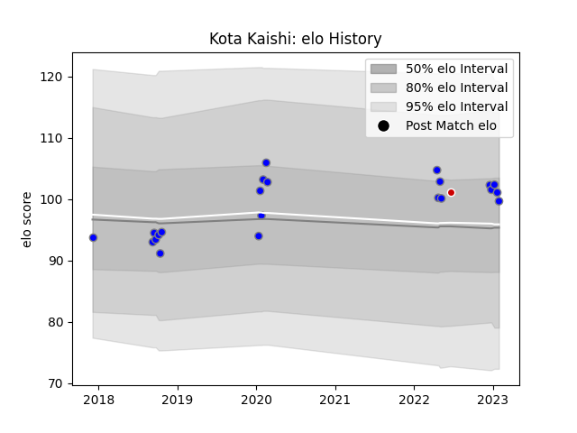

---  
layout: page  
title: Kota Kaishi  
date: 2023-01-13 11:33:29.661907  
categories: player  
---
# Kota Kaishi

## Positions: P

## Country: Japan

## Current elo: 102.0

## Current Percentile: 69.0

# Elo History

# Match History

| Team                              |   Appearances |   Win Rate |
|:----------------------------------|--------------:|-----------:|
| Kubota Spears Funabashi Tokyo-Bay |            20 |      0.775 |
| Japan                             |             1 |      1     |

| Opponent                  |   Matches |   Win Rate |
|:--------------------------|----------:|-----------:|
| Mie Honda Heat            |         2 |       1    |
| Munakata Sanix Blues      |         2 |       1    |
| Saitama Wild Knights      |         2 |       0    |
| Urayasu D-Rocks           |         2 |       1    |
| Yokohama Canon Eagles     |         2 |       0.75 |
| Black Rams Tokyo          |         1 |       1    |
| Coca-Cola Red Sparks      |         1 |       1    |
| Green Rockets Tokatsu     |         1 |       1    |
| Hanazono Kintetsu Liners  |         1 |       1    |
| Hino Red Dolphins         |         1 |       1    |
| Kobelco Kobe Steelers     |         1 |       1    |
| Shizuoka Blue Revs        |         1 |       0    |
| Tokyo Sungoliath          |         1 |       1    |
| Toshiba Brave Lupus Tokyo |         1 |       1    |
| Toyota Verblitz           |         1 |       0    |
| Uruguay                   |         1 |       1    |