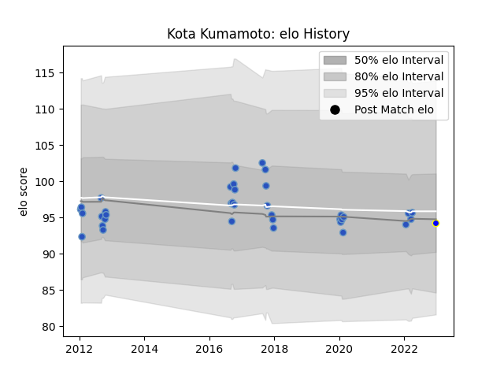

---  
layout: page  
title: Kota Kumamoto  
date: 2023-03-21 18:36:59.861204  
categories: player  
---
# Kota Kumamoto

Last updated: 2023-03-21
## Positions: H

## Current elo: 93.0

## Current Percentile: 47.0

# Elo History

# Match History

| Team                 |   Appearances |   Win Rate |
|:---------------------|--------------:|-----------:|
| Munakata Sanix Blues |            51 |   0.372549 |
| Kamaishi Seawaves    |             7 |   0.142857 |

| Opponent                          |   Matches |   Win Rate |
|:----------------------------------|----------:|-----------:|
| Mie Honda Heat                    |         5 |   0.4      |
| Urayasu D-Rocks                   |         5 |   0        |
| Toyota Industries Shuttles Aichi  |         5 |   0.4      |
| Kubota Spears Funabashi Tokyo-Bay |         5 |   0        |
| Toshiba Brave Lupus Tokyo         |         5 |   0.2      |
| Tokyo Sungoliath                  |         4 |   0        |
| Shizuoka Blue Revs                |         4 |   0        |
| Coca-Cola Red Sparks              |         3 |   1        |
| Green Rockets Tokatsu             |         3 |   0.666667 |
| Hanazono Kintetsu Liners          |         3 |   0.333333 |
| Shimizu Blue Sharks               |         3 |   0.666667 |
| NTT Docomo Red Hurricanes Osaka   |         2 |   1        |
| Yokohama Canon Eagles             |         2 |   0        |
| Kyuden Voltex                     |         2 |   1        |
| Saitama Wild Knights              |         1 |   0        |
| Mitsubishi Dynaboars              |         1 |   0        |
| Chugoku Red Regulions             |         1 |   1        |
| Kurita Water Gush                 |         1 |   1        |
| Kobelco Kobe Steelers             |         1 |   0        |
| Hino Red Dolphins                 |         1 |   1        |
| Black Rams Tokyo                  |         1 |   0        |