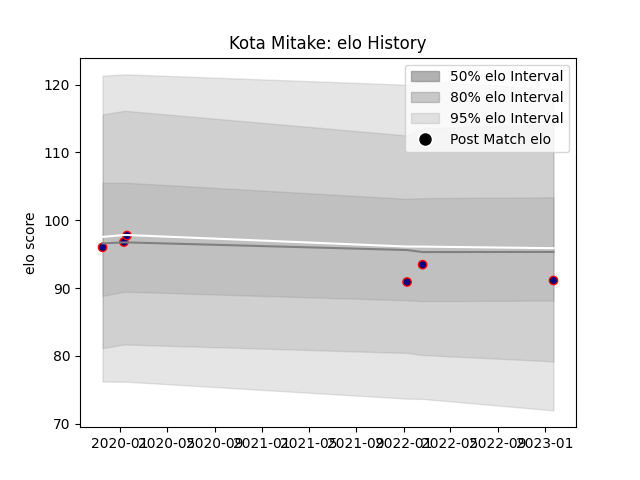

---  
layout: page  
title: Kota Mitake  
date: 2023-03-21 18:34:56.458664  
categories: player  
---
# Kota Mitake

Last updated: 2023-03-21
## Positions: P

## Current elo: 80.0

## Current Percentile: 11.0

# Elo History

# Match History

| Team                     |   Appearances |   Win Rate |
|:-------------------------|--------------:|-----------:|
| Hanazono Kintetsu Liners |            17 |   0.411765 |

| Opponent                         |   Matches |   Win Rate |
|:---------------------------------|----------:|-----------:|
| Kamaishi Seawaves                |         3 |          1 |
| Kurita Water Gush                |         2 |          1 |
| Mitsubishi Dynaboars             |         2 |          0 |
| Tokyo Sungoliath                 |         2 |          0 |
| Black Rams Tokyo                 |         1 |          0 |
| Coca-Cola Red Sparks             |         1 |          1 |
| Saitama Wild Knights             |         1 |          0 |
| Shimizu Blue Sharks              |         1 |          1 |
| Shizuoka Blue Revs               |         1 |          0 |
| Toshiba Brave Lupus Tokyo        |         1 |          0 |
| Toyota Industries Shuttles Aichi |         1 |          0 |
| Toyota Verblitz                  |         1 |          0 |