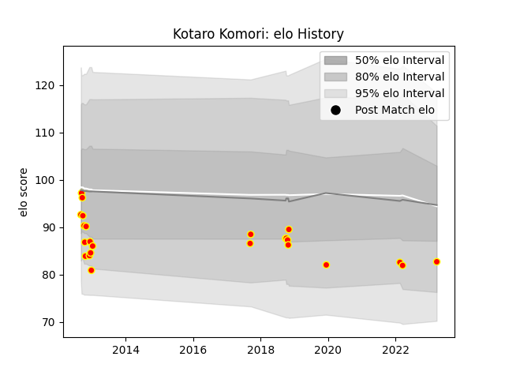

---  
layout: page  
title: Kotaro Komori  
date: 2023-03-27 11:34:02.925387  
categories: player  
---
# Kotaro Komori

Last updated: 2023-03-27
## Positions: SH

## Current elo: 83.0

## Current Percentile: None

# Elo History

# Match History

| Team          |   Appearances |   Win Rate |
|:--------------|--------------:|-----------:|
| Kyuden Voltex |            24 |       0.25 |

| Opponent                         |   Matches |   Win Rate |
|:---------------------------------|----------:|-----------:|
| Chugoku Red Regulions            |         3 |        1   |
| Munakata Sanix Blues             |         2 |        0   |
| NTT Docomo Red Hurricanes Osaka  |         2 |        0.5 |
| Urayasu D-Rocks                  |         1 |        0   |
| Toyota Verblitz                  |         1 |        0   |
| Toyota Industries Shuttles Aichi |         1 |        0   |
| Toshiba Brave Lupus Tokyo        |         1 |        0   |
| Tokyo Sungoliath                 |         1 |        0   |
| Shizuoka Blue Revs               |         1 |        0   |
| Saitama Wild Knights             |         1 |        0   |
| Black Rams Tokyo                 |         1 |        1   |
| Chubu Electric Power             |         1 |        1   |
| Mitsubishi Dynaboars             |         1 |        0   |
| Mazda Blue Zoomers               |         1 |        0   |
| Kurita Water Gush                |         1 |        0   |
| Kobelco Kobe Steelers            |         1 |        0   |
| Kamaishi Seawaves                |         1 |        0   |
| Hanazono Kintetsu Liners         |         1 |        0   |
| Green Rockets Tokatsu            |         1 |        0   |
| Yokohama Canon Eagles            |         1 |        0   |