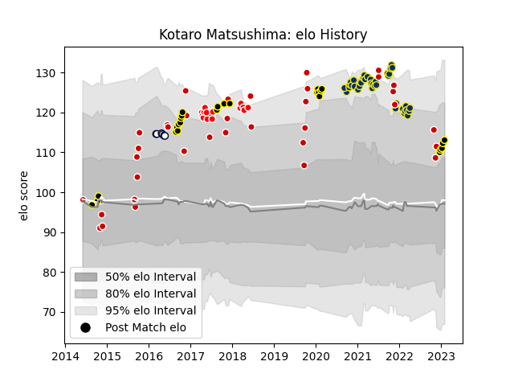

---  
layout: page  
title: Kotaro Matsushima  
date: 2023-03-17 17:14:28.359362  
categories: player  
---
# Kotaro Matsushima

## Positions: FB, W

## Country: Japan

## Current elo: 96.0

## Current Percentile: 42.0

# Elo History

# Match History

| Team              |   Appearances |   Win Rate |
|:------------------|--------------:|-----------:|
| Clermont Auvergne |            45 |   0.544444 |
| Tokyo Sungoliath  |            43 |   0.837209 |
| Japan             |            39 |   0.448718 |
| Sunwolves         |            14 |   0.214286 |
| Melbourne Rebels  |             6 |   0.333333 |

| Opponent                          |   Matches |   Win Rate |
|:----------------------------------|----------:|-----------:|
| Ireland                           |         5 |   0.2      |
| Bordeaux Begles                   |         5 |   0.3      |
| Scotland                          |         4 |   0.25     |
| Urayasu D-Rocks                   |         4 |   1        |
| Kobelco Kobe Steelers             |         4 |   0.25     |
| Green Rockets Tokatsu             |         4 |   1        |
| Stade Toulousain                  |         4 |   0.25     |
| Brive                             |         4 |   0.75     |
| Racing 92                         |         4 |   0.25     |
| Saitama Wild Knights              |         4 |   0.5      |
| La Rochelle                       |         4 |   0.5      |
| Samoa                             |         3 |   1        |
| Montpellier Herault               |         3 |   0.333333 |
| Georgia                           |         3 |   0.666667 |
| Pau                               |         3 |   0.666667 |
| Kubota Spears Funabashi Tokyo-Bay |         3 |   1        |
| Shizuoka Blue Revs                |         3 |   1        |
| South Africa                      |         3 |   0.333333 |
| Blues                             |         3 |   0.333333 |
| Toyota Verblitz                   |         3 |   1        |
| Sharks                            |         2 |   0        |
| Romania                           |         2 |   1        |
| Perpignan                         |         2 |   0.5      |
| Stade Francais Paris              |         2 |   1        |
| Stormers                          |         2 |   0.5      |
| New Zealand Maori                 |         2 |   0        |
| NTT Docomo Red Hurricanes Osaka   |         2 |   1        |
| Munakata Sanix Blues              |         2 |   1        |
| Toshiba Brave Lupus Tokyo         |         2 |   0        |
| Toulon                            |         2 |   0.5      |
| Lyon                              |         2 |   0.5      |
| Mie Honda Heat                    |         2 |   1        |
| Yokohama Canon Eagles             |         2 |   1        |
| France                            |         2 |   0.25     |
| Hanazono Kintetsu Liners          |         2 |   1        |
| Cheetahs                          |         2 |   0.5      |
| Chiefs                            |         2 |   0        |
| Bulls                             |         2 |   0.5      |
| Coca-Cola Red Sparks              |         2 |   1        |
| Black Rams Tokyo                  |         2 |   1        |
| Castres Olympique                 |         2 |   1        |
| Italy                             |         2 |   0.5      |
| Bayonne                           |         1 |   1        |
| Toyota Industries Shuttles Aichi  |         1 |   1        |
| United States of America          |         1 |   1        |
| Canada                            |         1 |   1        |
| Biarritz Olympique                |         1 |   1        |
| Australia                         |         1 |   0        |
| Tonga                             |         1 |   1        |
| Bristol Rugby                     |         1 |   1        |
| British and Irish Lions           |         1 |   0        |
| Brumbies                          |         1 |   0        |
| Uruguay                           |         1 |   1        |
| Wales                             |         1 |   0        |
| Wasps                             |         1 |   1        |
| Leicester Tigers                  |         1 |   0        |
| Sale Sharks                       |         1 |   1        |
| Lions                             |         1 |   0        |
| Russia                            |         1 |   1        |
| Crusaders                         |         1 |   0        |
| England                           |         1 |   0        |
| Queensland Reds                   |         1 |   1        |
| Portugal                          |         1 |   1        |
| Fiji                              |         1 |   0        |
| New Zealand                       |         1 |   0        |
| New South Wales Waratahs          |         1 |   0        |
| Highlanders                       |         1 |   0        |
| Munster                           |         1 |   0        |
| Hino Red Dolphins                 |         1 |   1        |
| Argentina                         |         1 |   0        |
| Jaguares                          |         1 |   0        |
| Agen                              |         1 |   1        |