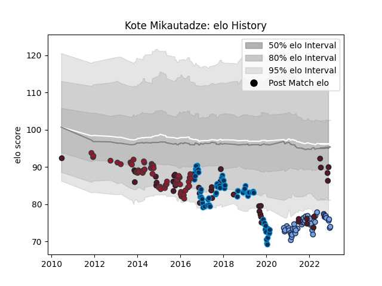

---  
layout: page  
title: Kote Mikautadze  
date: 2022-11-16 11:27:01.527243  
categories: player  
---
# Kote Mikautadze

## Positions: L

## Country: Georgia

## Current elo: 91.0

## Current Percentile: 10.0

# Elo History

# Match History

| Team                |   Appearances |   Win Rate |
|:--------------------|--------------:|-----------:|
| Montpellier Herault |            65 |   0.592308 |
| Toulon              |            48 |   0.666667 |
| Georgia             |            38 |   0.434211 |
| Bayonne             |            36 |   0.569444 |

| Opponent                 |   Matches |   Win Rate |
|:-------------------------|----------:|-----------:|
| Stade Toulousain         |        10 |   0.2      |
| La Rochelle              |        10 |   0.4      |
| Bordeaux Begles          |        10 |   0.55     |
| Toulon                   |         8 |   0.6875   |
| Castres Olympique        |         8 |   0.625    |
| Racing 92                |         8 |   0.375    |
| Clermont Auvergne        |         8 |   0.5      |
| Pau                      |         7 |   0.571429 |
| Stade Francais Paris     |         7 |   0.5      |
| Brive                    |         7 |   0.714286 |
| Grenoble                 |         7 |   0.571429 |
| Agen                     |         6 |   1        |
| Montpellier Herault      |         5 |   0.8      |
| Bayonne                  |         5 |   1        |
| Lyon                     |         4 |   0.5      |
| Leinster                 |         4 |   0.5      |
| Japan                    |         3 |   0        |
| United States of America |         3 |   0.666667 |
| Scotland                 |         3 |   0        |
| Argentina                |         3 |   0        |
| Canada                   |         3 |   1        |
| Glasgow Warriors         |         3 |   1        |
| Samoa                    |         3 |   0.666667 |
| Wales                    |         2 |   0        |
| Newcastle Falcons        |         2 |   0.5      |
| Oyonnax                  |         2 |   1        |
| Wasps                    |         2 |   0.5      |
| Perpignan                |         2 |   0.5      |
| Northampton Saints       |         2 |   0.5      |
| Uruguay                  |         2 |   1        |
| Tonga                    |         2 |   0.5      |
| Beziers                  |         2 |   0.5      |
| US Bressane              |         2 |   1        |
| Gloucester Rugby         |         2 |   0.5      |
| Fiji                     |         2 |   0.25     |
| Exeter Chiefs            |         2 |   0.5      |
| Romania                  |         2 |   1        |
| Vannes                   |         1 |   1        |
| Spain                    |         1 |   1        |
| South Africa             |         1 |   0        |
| Ulster                   |         1 |   1        |
| Rouen                    |         1 |   1        |
| Narbonne                 |         1 |   1        |
| Provence Rugby           |         1 |   0        |
| Portugal                 |         1 |   1        |
| Aurillac                 |         1 |   1        |
| Australia                |         1 |   0        |
| Bath Rugby               |         1 |   1        |
| Cardiff Blues            |         1 |   1        |
| Connacht                 |         1 |   1        |
| France                   |         1 |   0        |
| Ireland                  |         1 |   0        |
| Italy A                  |         1 |   0        |
| Montauban                |         1 |   1        |
| Munster                  |         1 |   1        |
| Namibia                  |         1 |   1        |
| Netherlands              |         1 |   1        |
| Nevers                   |         1 |   1        |
| New Zealand              |         1 |   0        |
| Petrarca Padova          |         1 |   1        |
| Zebre                    |         1 |   0.5      |