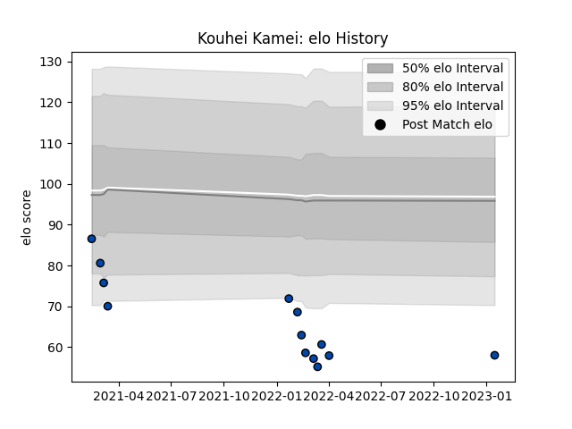

---  
layout: page  
title: Kouhei Kamei  
date: 2023-03-21 18:34:21.564018  
categories: player  
---
# Kouhei Kamei

Last updated: 2023-03-21
## Positions: C, W

## Current elo: 55.0

## Current Percentile: 1.0

# Elo History

# Match History

| Team                |   Appearances |   Win Rate |
|:--------------------|--------------:|-----------:|
| Skyactivs Hiroshima |            16 |      0.125 |

| Opponent                         |   Matches |   Win Rate |
|:---------------------------------|----------:|-----------:|
| Kamaishi Seawaves                |         3 |   0.333333 |
| Hanazono Kintetsu Liners         |         2 |   0        |
| Kyuden Voltex                    |         2 |   0        |
| Mie Honda Heat                   |         2 |   0        |
| Mitsubishi Dynaboars             |         2 |   0        |
| NTT Docomo Red Hurricanes Osaka  |         2 |   0        |
| Chugoku Red Regulions            |         1 |   1        |
| Coca-Cola Red Sparks             |         1 |   0        |
| Toyota Industries Shuttles Aichi |         1 |   0        |