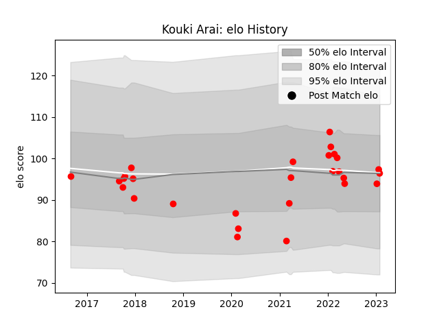

---  
layout: page  
title: Kouki Arai  
date: 2023-01-13 11:32:46.298180  
categories: player  
---
# Kouki Arai

## Positions: SH

## Current elo: 94.0

## Current Percentile: 46.0

# Elo History

# Match History

| Team                  |   Appearances |   Win Rate |
|:----------------------|--------------:|-----------:|
| Yokohama Canon Eagles |            26 |   0.538462 |

| Opponent                          |   Matches |   Win Rate |
|:----------------------------------|----------:|-----------:|
| Green Rockets Tokatsu             |         4 |   0.75     |
| Kobelco Kobe Steelers             |         3 |   0.666667 |
| Shizuoka Blue Revs                |         3 |   0.666667 |
| Black Rams Tokyo                  |         2 |   0.5      |
| Coca-Cola Red Sparks              |         2 |   1        |
| Munakata Sanix Blues              |         2 |   1        |
| NTT Docomo Red Hurricanes Osaka   |         2 |   0.5      |
| Saitama Wild Knights              |         2 |   0        |
| Tokyo Sungoliath                  |         2 |   0        |
| Kubota Spears Funabashi Tokyo-Bay |         1 |   0        |
| Mie Honda Heat                    |         1 |   0        |
| Toyota Industries Shuttles Aichi  |         1 |   1        |
| Toyota Verblitz                   |         1 |   0        |