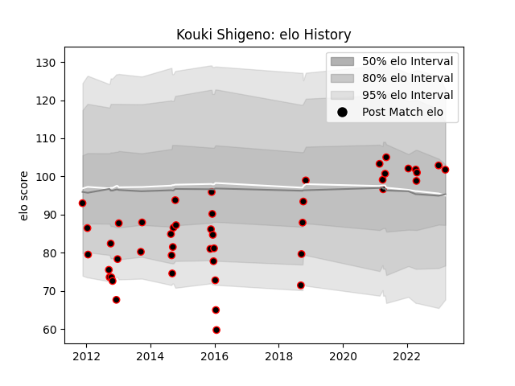

---  
layout: page  
title: Kouki Shigeno  
date: 2022-12-28 12:57:28.447968  
categories: player  
---
# Kouki Shigeno

## Positions: W

## Current elo: 96.0

## Current Percentile: 48.0

# Elo History

# Match History

| Team                            |   Appearances |   Win Rate |
|:--------------------------------|--------------:|-----------:|
| NTT Docomo Red Hurricanes Osaka |            38 |   0.276316 |

| Opponent                         |   Matches |   Win Rate |
|:---------------------------------|----------:|-----------:|
| Toyota Verblitz                  |         5 |   0        |
| Yokohama Canon Eagles            |         3 |   0.333333 |
| Coca-Cola Red Sparks             |         3 |   0.333333 |
| Hanazono Kintetsu Liners         |         3 |   0        |
| Toshiba Brave Lupus Tokyo        |         3 |   0        |
| Shizuoka Blue Revs               |         2 |   0        |
| Tokyo Sungoliath                 |         2 |   0        |
| Black Rams Tokyo                 |         2 |   0        |
| Kobelco Kobe Steelers            |         2 |   0.5      |
| Green Rockets Tokatsu            |         2 |   0.25     |
| Kurita Water Gush                |         1 |   1        |
| Kyuden Voltex                    |         1 |   0        |
| Chugoku Red Regulions            |         1 |   1        |
| Mitsubishi Dynaboars             |         1 |   1        |
| Munakata Sanix Blues             |         1 |   1        |
| Saitama Wild Knights             |         1 |   0        |
| Kamaishi Seawaves                |         1 |   1        |
| Hino Red Dolphins                |         1 |   1        |
| Toyota Industries Shuttles Aichi |         1 |   0        |
| Urayasu D-Rocks                  |         1 |   0        |
| Mazda Blue Zoomers               |         1 |   1        |