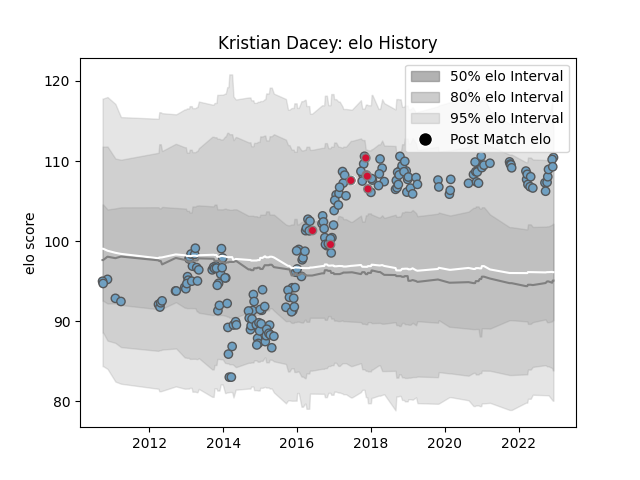

---  
layout: page  
title: Kristian Dacey  
date: 2023-02-02 19:11:18.424771  
categories: player  
---
# Kristian Dacey

## Positions: H

## Country: Wales

## Current elo: 89.0

## Current Percentile: 31.0

# Elo History

# Match History

| Team                    |   Appearances |   Win Rate |
|:------------------------|--------------:|-----------:|
| Cardiff Blues           |           193 |   0.487047 |
| Wales                   |             9 |   0.555556 |
| British and Irish Lions |             2 |   0.75     |

| Opponent            |   Matches |   Win Rate |
|:--------------------|----------:|-----------:|
| Ospreys             |        17 |   0.117647 |
| Glasgow Warriors    |        16 |   0.25     |
| Dragons             |        15 |   0.8      |
| Benetton Treviso    |        15 |   0.666667 |
| Scarlets            |        15 |   0.466667 |
| Munster             |        15 |   0.333333 |
| Edinburgh           |        14 |   0.714286 |
| Connacht            |        14 |   0.607143 |
| Leinster            |        11 |   0        |
| Ulster              |        10 |   0.3      |
| Zebre               |         8 |   0.75     |
| Montpellier Herault |         3 |   0.333333 |
| London Irish        |         3 |   0.666667 |
| Stade Toulousain    |         2 |   1        |
| Stormers            |         2 |   0.5      |
| Pau                 |         2 |   1        |
| Bulls               |         2 |   0        |
| Sharks              |         2 |   1        |
| Lyon                |         2 |   1        |
| Bath Rugby          |         2 |   0.5      |
| Saracens            |         2 |   0        |
| Rovigo              |         2 |   1        |
| Toulon              |         2 |   0.5      |
| Harlequins          |         2 |   0        |
| Grenoble            |         2 |   1        |
| Gloucester Rugby    |         2 |   0.5      |
| Exeter Chiefs       |         2 |   0.25     |
| Tonga               |         1 |   1        |
| Southern Kings      |         1 |   1        |
| South Africa        |         1 |   1        |
| Bristol Rugby       |         1 |   1        |
| Brive               |         1 |   1        |
| Worcester Warriors  |         1 |   0        |
| Chiefs              |         1 |   1        |
| New Zealand         |         1 |   0        |
| Sale Sharks         |         1 |   1        |
| Newcastle Falcons   |         1 |   1        |
| England             |         1 |   0        |
| Calvisano           |         1 |   1        |
| Lions               |         1 |   0        |
| Japan               |         1 |   1        |
| Italy               |         1 |   1        |
| Ireland             |         1 |   0        |
| Hurricanes          |         1 |   0.5      |
| Cheetahs            |         1 |   1        |
| Georgia             |         1 |   1        |
| Australia           |         1 |   0        |