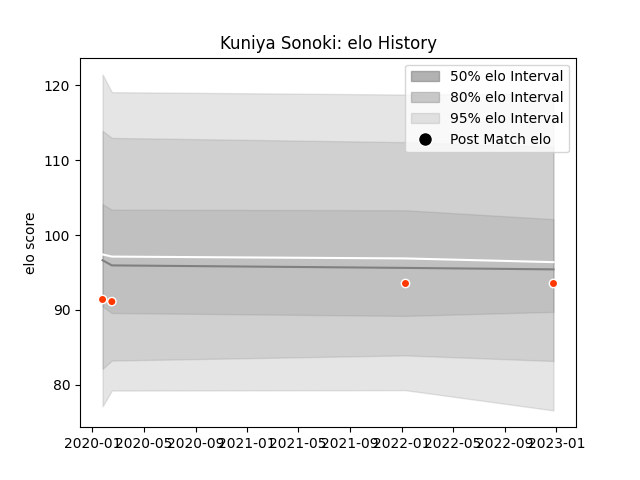

---  
layout: page  
title: Kuniya Sonoki  
date: 2022-12-28 12:52:56.804096  
categories: player  
---
# Kuniya Sonoki

## Positions: C, W

## Current elo: 94.0

## Current Percentile: 41.0

# Elo History

# Match History

| Team              |   Appearances |   Win Rate |
|:------------------|--------------:|-----------:|
| Hino Red Dolphins |             4 |       0.25 |

| Opponent                          |   Matches |   Win Rate |
|:----------------------------------|----------:|-----------:|
| Kubota Spears Funabashi Tokyo-Bay |         1 |          0 |
| Skyactivs Hiroshima               |         1 |          1 |
| Toyota Industries Shuttles Aichi  |         1 |          0 |
| Toyota Verblitz                   |         1 |          0 |