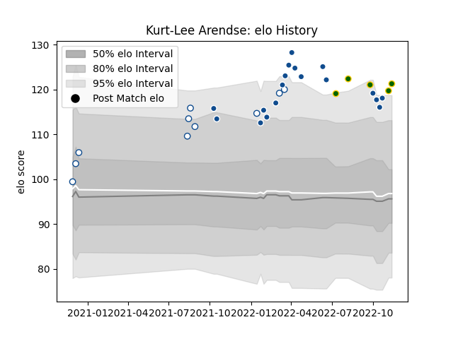

---  
layout: page  
title: Kurt-Lee Arendse  
date: 2022-12-09 13:16:34.130403  
categories: player  
---
# Kurt-Lee Arendse

## Positions: FB, W

## Country: South Africa

## Current elo: 130.0

## Current Percentile: 98.0

# Elo History

# Match History

| Team         |   Appearances |   Win Rate |
|:-------------|--------------:|-----------:|
| Bulls        |            19 |   0.684211 |
| Blue Bulls   |            10 |   0.9      |
| South Africa |             7 |   0.571429 |

| Opponent            |   Matches |   Win Rate |
|:--------------------|----------:|-----------:|
| Stormers            |         3 |        0   |
| Lions               |         2 |        1   |
| Cardiff Blues       |         2 |        1   |
| Free State Cheetahs |         2 |        1   |
| Pumas               |         2 |        1   |
| Griquas             |         2 |        1   |
| Natal Sharks        |         2 |        0.5 |
| Benetton Treviso    |         2 |        1   |
| Munster             |         2 |        0.5 |
| Argentina           |         1 |        1   |
| Western Province    |         1 |        1   |
| Wales               |         1 |        0   |
| Ulster              |         1 |        1   |
| Scarlets            |         1 |        1   |
| New Zealand         |         1 |        1   |
| Italy               |         1 |        1   |
| Leinster            |         1 |        1   |
| Ireland             |         1 |        0   |
| Golden Lions        |         1 |        1   |
| Glasgow Warriors    |         1 |        0   |
| France              |         1 |        0   |
| England             |         1 |        1   |
| Edinburgh           |         1 |        0   |
| Dragons             |         1 |        1   |
| Connacht            |         1 |        1   |
| Zebre               |         1 |        1   |