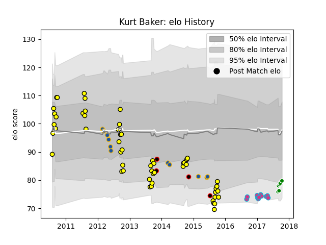

---  
layout: page  
title: Kurt Baker  
date: 2023-03-21 18:13:43.972683  
categories: player  
---
# Kurt Baker

Last updated: 2023-03-21
## Positions: FB, W

## Country: New Zealand Maori

## Current elo: 80.0

## Current Percentile: 12.0

# Elo History

# Match History

| Team              |   Appearances |   Win Rate |
|:------------------|--------------:|-----------:|
| Taranaki          |            53 |   0.566038 |
| Highlanders       |            11 |   0.636364 |
| Zebre             |            11 |   0        |
| Manawatu          |             6 |   0.5      |
| New Zealand Maori |             4 |   1        |

| Opponent                 |   Matches |   Win Rate |
|:-------------------------|----------:|-----------:|
| Canterbury               |         8 |   0.375    |
| Tasman                   |         8 |   0.75     |
| Auckland                 |         6 |   0.333333 |
| Bay of Plenty            |         6 |   0.833333 |
| Waikato                  |         5 |   0.6      |
| Northland                |         5 |   0.8      |
| Wellington               |         4 |   0        |
| Manawatu                 |         4 |   0.5      |
| Blues                    |         3 |   1        |
| Counties Manukau         |         3 |   0.666667 |
| Southland                |         3 |   1        |
| Hawke's Bay              |         3 |   0.666667 |
| Otago                    |         3 |   0.333333 |
| Ospreys                  |         2 |   0        |
| Wasps                    |         1 |   0        |
| United States of America |         1 |   1        |
| New South Wales Waratahs |         1 |   1        |
| Sharks                   |         1 |   0        |
| Scarlets                 |         1 |   0        |
| Queensland Reds          |         1 |   1        |
| Taranaki                 |         1 |   0        |
| Leinster                 |         1 |   0        |
| Melbourne Rebels         |         1 |   1        |
| Japan                    |         1 |   1        |
| Hurricanes               |         1 |   0        |
| Glasgow Warriors         |         1 |   0        |
| Fiji                     |         1 |   1        |
| Edinburgh                |         1 |   0        |
| Dragons                  |         1 |   0        |
| Crusaders                |         1 |   0        |
| Connacht                 |         1 |   0        |
| Chiefs                   |         1 |   1        |
| Cardiff Blues            |         1 |   0        |
| Canada                   |         1 |   1        |
| Benetton Treviso         |         1 |   0        |
| Western Force            |         1 |   0        |