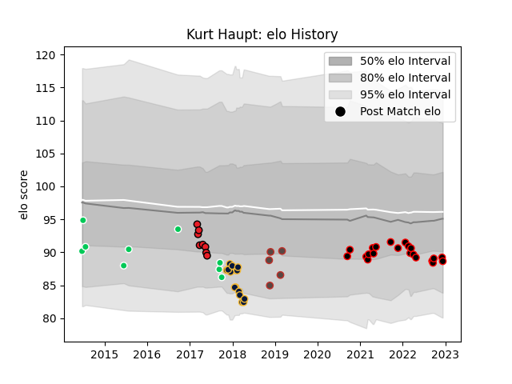

---  
layout: page  
title: Kurt Haupt  
date: 2022-12-18 16:21:54.091814  
categories: player  
---
# Kurt Haupt

## Positions: H

## Country: Germany

## Current elo: 89.0

## Current Percentile: 22.0

# Elo History

# Match History

| Team               |   Appearances |   Win Rate |
|:-------------------|--------------:|-----------:|
| Nice               |            21 |   0.642857 |
| Worcester Warriors |            15 |   0.4      |
| SWD Eagles         |             9 |   0.222222 |
| Southern Kings     |             8 |   0.375    |
| Germany            |             5 |   0.4      |

| Opponent                   |   Matches |   Win Rate |
|:---------------------------|----------:|-----------:|
| Bourgoin-Jallieu           |         4 |   0.5      |
| Albi                       |         3 |   0.833333 |
| Exeter Chiefs              |         2 |   1        |
| Valke                      |         2 |   0.5      |
| Suresnes                   |         2 |   1        |
| Sharks                     |         2 |   0.5      |
| Oyonnax                    |         2 |   0.5      |
| Massy                      |         2 |   1        |
| Lions                      |         2 |   0        |
| Griquas                    |         2 |   0        |
| Leicester Tigers           |         2 |   0.5      |
| Boland Cavaliers           |         2 |   0.5      |
| Cognac Saint Jean d'Angély |         2 |   0.5      |
| Dax                        |         1 |   0        |
| New South Wales Waratahs   |         1 |   1        |
| US Bressane                |         1 |   1        |
| Border Bulldogs            |         1 |   0        |
| Sunwolves                  |         1 |   1        |
| Stormers                   |         1 |   0        |
| Brive                      |         1 |   0        |
| Saracens                   |         1 |   0        |
| Sale Sharks                |         1 |   0        |
| Russia                     |         1 |   0        |
| Romania                    |         1 |   0        |
| Rennes                     |         1 |   1        |
| Brumbies                   |         1 |   0        |
| Newcastle Falcons          |         1 |   1        |
| Narbonne                   |         1 |   0        |
| Dijon                      |         1 |   0        |
| Canada                     |         1 |   0        |
| London Irish               |         1 |   0        |
| Carqueiranne-Hyères        |         1 |   1        |
| Leopards                   |         1 |   0        |
| Aubenas                    |         1 |   1        |
| Kenya                      |         1 |   1        |
| Hong Kong                  |         1 |   1        |
| Harlequins                 |         1 |   0        |
| Chambery                   |         1 |   0        |
| Griffons                   |         1 |   0        |
| Gloucester Rugby           |         1 |   1        |
| Dragons                    |         1 |   0        |
| Wasps                      |         1 |   0        |