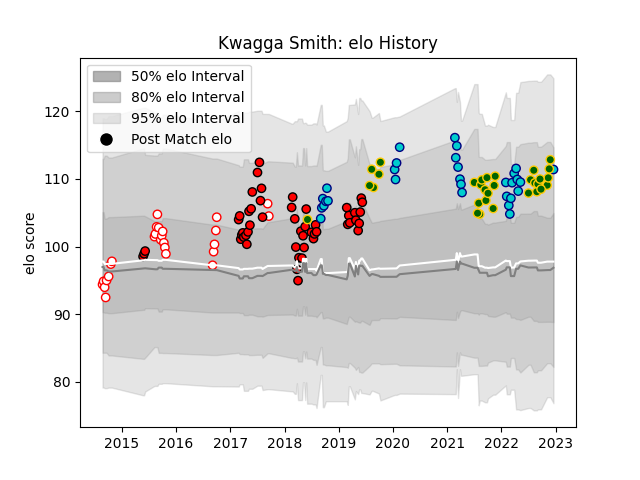

---  
layout: page  
title: Kwagga Smith  
date: 2022-11-22 11:47:27.635604  
categories: player  
---
# Kwagga Smith

## Positions: FL, N8

## Country: South Africa

## Current elo: 109.0

## Current Percentile: 81.0

# Elo History

# Match History

| Team               |   Appearances |   Win Rate |
|:-------------------|--------------:|-----------:|
| Lions              |            50 |   0.69     |
| South Africa       |            30 |   0.65     |
| Shizuoka Blue Revs |            29 |   0.551724 |
| Golden Lions       |            26 |   0.769231 |

| Opponent                          |   Matches |   Win Rate |
|:----------------------------------|----------:|-----------:|
| Argentina                         |         6 |   1        |
| Sharks                            |         6 |   0.666667 |
| Western Province                  |         6 |   0.666667 |
| Stormers                          |         6 |   0.75     |
| Jaguares                          |         6 |   0.666667 |
| New Zealand                       |         5 |   0.5      |
| New South Wales Waratahs          |         5 |   1        |
| Natal Sharks                      |         5 |   0.8      |
| Black Rams Tokyo                  |         4 |   0.75     |
| Wales                             |         4 |   0.75     |
| Crusaders                         |         4 |   0        |
| Eastern Province Kings            |         4 |   1        |
| Australia                         |         4 |   0.25     |
| British and Irish Lions           |         3 |   0.666667 |
| Hurricanes                        |         3 |   0.333333 |
| Toshiba Brave Lupus Tokyo         |         3 |   0.333333 |
| Blue Bulls                        |         3 |   0.333333 |
| Saitama Wild Knights              |         3 |   0        |
| Pumas                             |         3 |   1        |
| NTT Docomo Red Hurricanes Osaka   |         3 |   1        |
| Yokohama Canon Eagles             |         3 |   0.333333 |
| Bulls                             |         3 |   0.666667 |
| Free State Cheetahs               |         3 |   0.666667 |
| Queensland Reds                   |         2 |   0.5      |
| Green Rockets Tokatsu             |         2 |   1        |
| Toyota Verblitz                   |         2 |   0.5      |
| Cheetahs                          |         2 |   1        |
| Sunwolves                         |         2 |   1        |
| Southern Kings                    |         2 |   1        |
| Highlanders                       |         2 |   0.5      |
| Melbourne Rebels                  |         2 |   1        |
| Kobelco Kobe Steelers             |         2 |   0        |
| Brumbies                          |         2 |   1        |
| Griquas                           |         2 |   1        |
| Kubota Spears Funabashi Tokyo-Bay |         2 |   0.5      |
| Namibia                           |         1 |   1        |
| Ireland                           |         1 |   0        |
| Western Force                     |         1 |   1        |
| Canada                            |         1 |   1        |
| Urayasu D-Rocks                   |         1 |   1        |
| Italy                             |         1 |   1        |
| Tokyo Sungoliath                  |         1 |   0        |
| Chiefs                            |         1 |   1        |
| Georgia                           |         1 |   1        |
| Blues                             |         1 |   0        |
| Scotland                          |         1 |   1        |
| Coca-Cola Red Sparks              |         1 |   1        |
| England                           |         1 |   0        |
| France                            |         1 |   0        |
| Mie Honda Heat                    |         1 |   1        |
| Hino Red Dolphins                 |         1 |   1        |