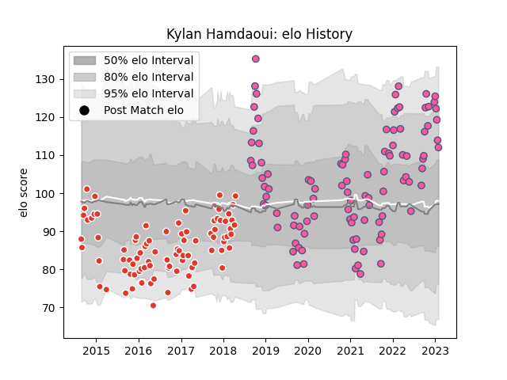

---  
layout: page  
title: Kylan Hamdaoui  
date: 2022-12-28 12:54:08.272328  
categories: player  
---
# Kylan Hamdaoui

## Positions: FB, W

## Current elo: 119.0

## Current Percentile: 93.0

# Elo History

# Match History

| Team                 |   Appearances |   Win Rate |
|:---------------------|--------------:|-----------:|
| Stade Francais Paris |            96 |   0.479167 |
| Biarritz Olympique   |            88 |   0.556818 |

| Opponent            |   Matches |   Win Rate |
|:--------------------|----------:|-----------:|
| Perpignan           |        11 |   0.727273 |
| Agen                |         8 |   0.75     |
| Clermont Auvergne   |         8 |   0.25     |
| Racing 92           |         8 |   0.25     |
| Lyon                |         8 |   0.25     |
| Bayonne             |         8 |   0.625    |
| Aurillac            |         8 |   0.375    |
| Toulon              |         7 |   0.428571 |
| La Rochelle         |         7 |   0.428571 |
| Pau                 |         7 |   0.714286 |
| Colomiers           |         7 |   0.571429 |
| Montauban           |         7 |   0.428571 |
| Bordeaux Begles     |         7 |   0.285714 |
| Dax                 |         6 |   0.833333 |
| Stade Toulousain    |         6 |   0.583333 |
| Montpellier Herault |         6 |   0.25     |
| Narbonne            |         6 |   0.833333 |
| Castres Olympique   |         5 |   0.6      |
| Carcassonne         |         5 |   0.4      |
| Brive               |         5 |   0.4      |
| Mont-de-Marsan      |         5 |   0.6      |
| Bourgoin-Jallieu    |         4 |   0.75     |
| Albi                |         4 |   0.25     |
| Vannes              |         3 |   0.666667 |
| Soyaux-Angouleme    |         3 |   0.666667 |
| Tarbes              |         3 |   0.666667 |
| Beziers             |         3 |   0.666667 |
| Massy               |         3 |   0.666667 |
| Grenoble            |         3 |   0.666667 |
| Oyonnax             |         2 |   0.5      |
| Biarritz Olympique  |         2 |   0.5      |
| Worcester Warriors  |         2 |   0        |
| Ospreys             |         1 |   1        |
| Nevers              |         1 |   1        |
| Provence Rugby      |         1 |   0        |
| Connacht            |         1 |   1        |
| Benetton Treviso    |         1 |   0        |
| Bristol Rugby       |         1 |   0        |
| Zebre               |         1 |   1        |