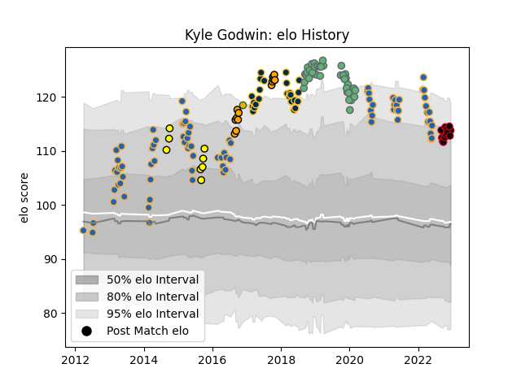

---  
layout: page  
title: Kyle Godwin  
date: 2023-02-02 18:57:56.726809  
categories: player  
---
# Kyle Godwin

## Positions: C

## Country: Australia

## Current elo: 126.0

## Current Percentile: 93.0

# Elo History

# Match History

| Team               |   Appearances |   Win Rate |
|:-------------------|--------------:|-----------:|
| Western Force      |            83 |   0.259036 |
| Connacht           |            38 |   0.526316 |
| Brumbies           |            24 |   0.5      |
| Lyon               |            18 |   0.5      |
| NSW Country Eagles |            13 |   0.807692 |
| Perth Spirit       |             8 |   0.625    |
| Australia          |             1 |   1        |

| Opponent                 |   Matches |   Win Rate |
|:-------------------------|----------:|-----------:|
| New South Wales Waratahs |        15 |   0.4      |
| Melbourne Rebels         |        15 |   0.333333 |
| Queensland Reds          |        14 |   0.464286 |
| Brumbies                 |        10 |   0        |
| Bulls                    |         7 |   0.428571 |
| Highlanders              |         7 |   0.285714 |
| Cheetahs                 |         7 |   0.571429 |
| Crusaders                |         6 |   0.166667 |
| Chiefs                   |         6 |   0.166667 |
| Southern Kings           |         5 |   0.8      |
| Blues                    |         5 |   0        |
| Queensland Country       |         4 |   0.5      |
| Leinster                 |         4 |   0        |
| Hurricanes               |         4 |   0.5      |
| Ulster                   |         3 |   0.666667 |
| Sharks                   |         3 |   0        |
| Sale Sharks              |         3 |   0.333333 |
| Brisbane City            |         3 |   0.5      |
| Perpignan                |         3 |   0.666667 |
| Montpellier Herault      |         3 |   0.666667 |
| Sunwolves                |         3 |   1        |
| Melbourne Rising         |         3 |   1        |
| Greater Sydney Rams      |         2 |   1        |
| Saracens                 |         2 |   0        |
| Edinburgh                |         2 |   0        |
| Bordeaux Begles          |         2 |   1        |
| Sydney Stars             |         2 |   0.5      |
| Perth Spirit             |         2 |   1        |
| Glasgow Warriors         |         2 |   0        |
| Stade Toulousain         |         2 |   0.5      |
| Ospreys                  |         2 |   0.5      |
| North Harbour Rays       |         2 |   0.5      |
| Brive                    |         2 |   0.5      |
| Stormers                 |         2 |   0        |
| Gloucester Rugby         |         2 |   0.5      |
| Benetton Treviso         |         2 |   1        |
| Canberra Vikings         |         2 |   1        |
| Lions                    |         2 |   0        |
| Cardiff Blues            |         2 |   0.5      |
| Jaguares                 |         2 |   0.5      |
| Toulon                   |         1 |   0        |
| Stade Francais Paris     |         1 |   1        |
| Sydney Rays              |         1 |   1        |
| Western Force            |         1 |   1        |
| Bayonne                  |         1 |   0        |
| Scarlets                 |         1 |   0        |
| Racing 92                |         1 |   0        |
| Pau                      |         1 |   1        |
| Munster                  |         1 |   0        |
| Moana Pasifika           |         1 |   1        |
| La Rochelle              |         1 |   0        |
| France                   |         1 |   1        |
| Dragons                  |         1 |   1        |
| Clermont Auvergne        |         1 |   1        |
| Castres Olympique        |         1 |   1        |
| Zebre                    |         1 |   1        |