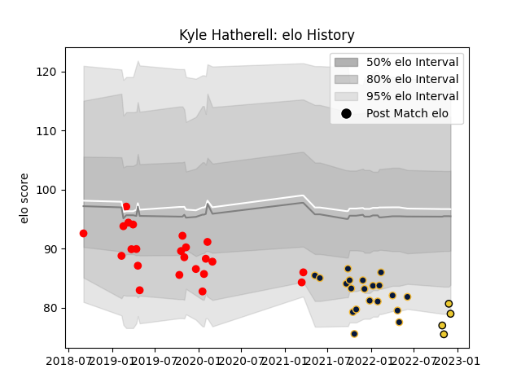

---  
layout: page  
title: Kyle Hatherell  
date: 2022-12-09 13:22:46.180377  
categories: player  
---
# Kyle Hatherell

## Positions: FL, L

## Current elo: 79.0

## Current Percentile: 6.0

# Elo History

# Match History

| Team               |   Appearances |   Win Rate |
|:-------------------|--------------:|-----------:|
| Jersey             |            23 |   0.347826 |
| Worcester Warriors |            20 |   0.225    |
| La Rochelle        |             4 |   0.5      |

| Opponent             |   Matches |   Win Rate |
|:---------------------|----------:|-----------:|
| Newcastle Falcons    |         4 |   0.125    |
| Leicester Tigers     |         3 |   0        |
| Saracens             |         3 |   0        |
| Coventry             |         3 |   0.333333 |
| Ealing Trailfinders  |         3 |   0        |
| London Scottish      |         2 |   0        |
| Wasps                |         2 |   0.5      |
| Sale Sharks          |         2 |   0.5      |
| Richmond             |         2 |   0.5      |
| Nottingham           |         2 |   0.5      |
| Northampton Saints   |         2 |   0        |
| Bath Rugby           |         2 |   0.5      |
| Exeter Chiefs        |         2 |   0        |
| Doncaster            |         2 |   1        |
| Cornish Pirates      |         2 |   0.5      |
| Yorkshire Carnegie   |         2 |   1        |
| Bedford              |         1 |   0        |
| London Irish         |         1 |   1        |
| Hartpury College     |         1 |   0        |
| Harlequins           |         1 |   0        |
| Gloucester Rugby     |         1 |   0        |
| Pau                  |         1 |   0        |
| Castres Olympique    |         1 |   1        |
| Stade Francais Paris |         1 |   0        |
| Brive                |         1 |   1        |