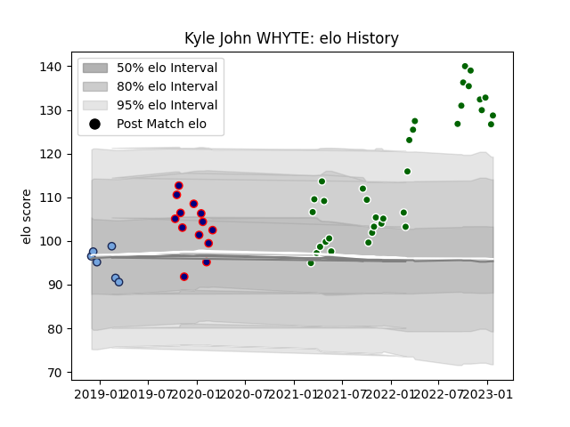

---  
layout: page  
title: Kyle John WHYTE  
date: 2023-03-27 11:37:31.780255  
categories: player  
---
# Kyle John WHYTE

Last updated: 2023-03-27
## Positions: P

## Current elo: 124.0

## Current Percentile: 97.0

# Elo History

# Match History

| Team                |   Appearances |   Win Rate |
|:--------------------|--------------:|-----------:|
| Ealing Trailfinders |            38 |   0.868421 |
| London Scottish     |            13 |   0.346154 |
| Bayonne             |             6 |   0.5      |

| Opponent            |   Matches |   Win Rate |
|:--------------------|----------:|-----------:|
| Ampthill            |         6 |   0.75     |
| Nottingham          |         6 |   0.666667 |
| Hartpury College    |         5 |   0.8      |
| Cornish Pirates     |         5 |   0.8      |
| Coventry            |         5 |   0.6      |
| Richmond            |         4 |   1        |
| London Scottish     |         4 |   1        |
| Doncaster           |         4 |   0.5      |
| Bedford             |         4 |   0.75     |
| Jersey              |         3 |   1        |
| Yorkshire Carnegie  |         2 |   1        |
| Ealing Trailfinders |         1 |   0        |
| Aurillac            |         1 |   0        |
| Mont-de-Marsan      |         1 |   0        |
| Newcastle Falcons   |         1 |   0        |
| Colomiers           |         1 |   1        |
| Provence Rugby      |         1 |   0        |
| Saracens            |         1 |   0        |
| US Bressane         |         1 |   1        |
| Vannes              |         1 |   1        |