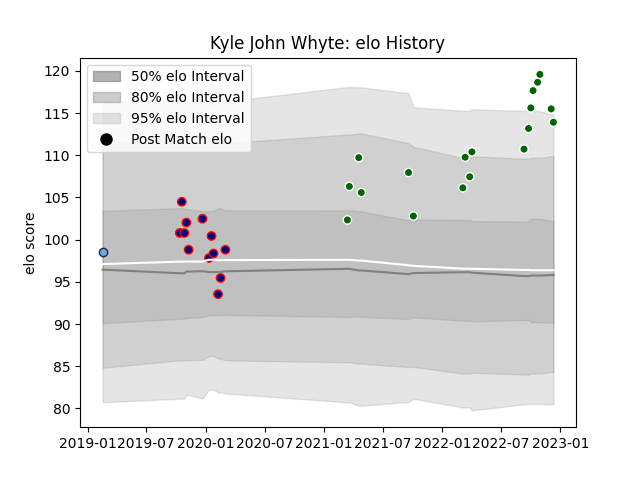

---  
layout: page  
title: Kyle John Whyte  
date: 2022-12-14 11:25:47.209841  
categories: player  
---
# Kyle John Whyte

## Positions: P

## Current elo: 114.0

## Current Percentile: 95.0

# Elo History

# Match History

| Team                |   Appearances |   Win Rate |
|:--------------------|--------------:|-----------:|
| Ealing Trailfinders |            18 |   0.888889 |
| London Scottish     |            12 |   0.291667 |
| Bayonne             |             1 |   1        |

| Opponent            |   Matches |   Win Rate |
|:--------------------|----------:|-----------:|
| Ampthill            |         4 |   0.625    |
| Cornish Pirates     |         3 |   0.666667 |
| Coventry            |         3 |   0.666667 |
| Hartpury College    |         3 |   0.666667 |
| Nottingham          |         3 |   0.333333 |
| Bedford             |         2 |   0.5      |
| Jersey              |         2 |   1        |
| London Scottish     |         2 |   1        |
| Richmond            |         2 |   1        |
| Yorkshire Carnegie  |         2 |   1        |
| Doncaster           |         1 |   1        |
| Ealing Trailfinders |         1 |   0        |
| Newcastle Falcons   |         1 |   0        |
| Saracens            |         1 |   0        |
| US Bressane         |         1 |   1        |