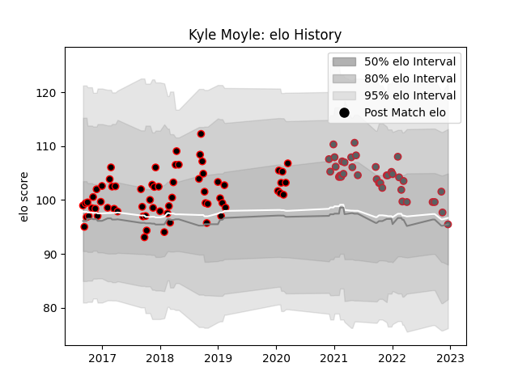

---  
layout: page  
title: Kyle Moyle  
date: 2022-11-16 11:28:58.925988  
categories: player  
---
# Kyle Moyle

## Positions: FB, W

## Current elo: 96.0

## Current Percentile: 64.0

# Elo History

# Match History

| Team             |   Appearances |   Win Rate |
|:-----------------|--------------:|-----------:|
| Cornish Pirates  |            65 |   0.561538 |
| Gloucester Rugby |            35 |   0.385714 |

| Opponent            |   Matches |   Win Rate |
|:--------------------|----------:|-----------:|
| London Irish        |         7 |   0.357143 |
| Ealing Trailfinders |         6 |   0.416667 |
| Richmond            |         6 |   0.666667 |
| Nottingham          |         6 |   0.666667 |
| Jersey              |         6 |   0.166667 |
| Yorkshire Carnegie  |         6 |   0.5      |
| Doncaster           |         6 |   1        |
| Wasps               |         5 |   0.8      |
| Sale Sharks         |         5 |   0.2      |
| Bedford             |         5 |   0.8      |
| Bristol Rugby       |         5 |   0.2      |
| London Scottish     |         5 |   0.6      |
| Northampton Saints  |         4 |   0.5      |
| Rotherham Titans    |         4 |   0.5      |
| Newcastle Falcons   |         4 |   0.25     |
| Hartpury College    |         4 |   1        |
| Exeter Chiefs       |         3 |   0        |
| Coventry            |         3 |   0.333333 |
| Bath Rugby          |         2 |   0.5      |
| Leicester Tigers    |         2 |   0        |
| Harlequins          |         2 |   0        |
| London Welsh        |         1 |   1        |
| Saracens            |         1 |   0        |
| Worcester Warriors  |         1 |   1        |
| Ampthill            |         1 |   1        |