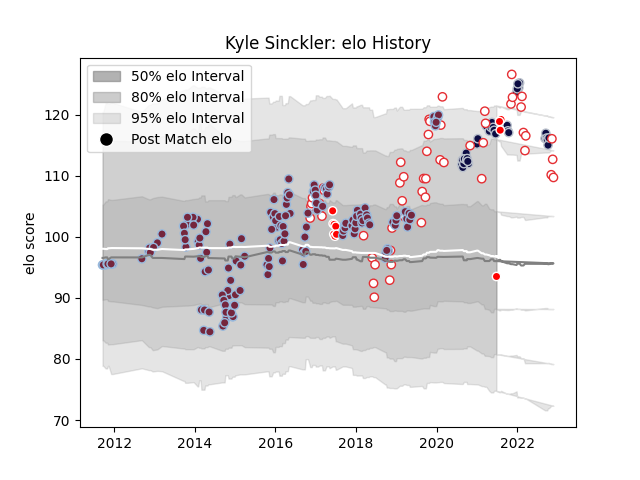

---  
layout: page  
title: Kyle Sinckler  
date: 2022-11-15 23:44:06.069109  
categories: player  
---
# Kyle Sinckler

## Positions: P

## Country: England

## Current elo: 111.0

## Current Percentile: 87.0

# Elo History

# Match History

| Team                    |   Appearances |   Win Rate |
|:------------------------|--------------:|-----------:|
| Harlequins              |           156 |   0.512821 |
| England                 |            52 |   0.663462 |
| Bristol Rugby           |            34 |   0.647059 |
| British and Irish Lions |            10 |   0.45     |

| Opponent                 |   Matches |   Win Rate |
|:-------------------------|----------:|-----------:|
| Wasps                    |        17 |   0.647059 |
| Exeter Chiefs            |        16 |   0.25     |
| Bath Rugby               |        15 |   0.733333 |
| Leicester Tigers         |        14 |   0.535714 |
| Saracens                 |        14 |   0.214286 |
| Gloucester Rugby         |        13 |   0.653846 |
| Sale Sharks              |        12 |   0.5      |
| Northampton Saints       |        12 |   0.333333 |
| Newcastle Falcons        |        11 |   0.545455 |
| South Africa             |        10 |   0.5      |
| London Irish             |        10 |   0.7      |
| Worcester Warriors       |         8 |   0.625    |
| Ireland                  |         7 |   0.428571 |
| Wales                    |         6 |   0.5      |
| Italy                    |         6 |   1        |
| France                   |         6 |   0.5      |
| New Zealand              |         5 |   0.5      |
| Australia                |         4 |   1        |
| Scotland                 |         4 |   0.625    |
| Ulster                   |         4 |   0        |
| London Welsh             |         4 |   1        |
| Stade Francais Paris     |         3 |   0.666667 |
| Clermont Auvergne        |         3 |   0        |
| Harlequins               |         3 |   0.333333 |
| Cardiff Blues            |         3 |   0.666667 |
| Argentina                |         3 |   0.666667 |
| Stade Toulousain         |         2 |   0.5      |
| Montpellier Herault      |         2 |   0.5      |
| Grenoble                 |         2 |   0.5      |
| Leinster                 |         2 |   0.5      |
| Japan                    |         2 |   1        |
| Timisoara Saracens       |         2 |   1        |
| Tonga                    |         2 |   1        |
| Edinburgh                |         2 |   0        |
| Dragons                  |         2 |   1        |
| Calvisano                |         2 |   1        |
| Bristol Rugby            |         2 |   0.5      |
| Scarlets                 |         2 |   0.5      |
| Toulon                   |         1 |   1        |
| United States of America |         1 |   1        |
| Agen                     |         1 |   1        |
| Racing 92                |         1 |   1        |
| Provincial Union XV      |         1 |   1        |
| New Zealand Maori        |         1 |   1        |
| Highlanders              |         1 |   0        |
| Fiji                     |         1 |   1        |
| Connacht                 |         1 |   1        |
| Castres Olympique        |         1 |   1        |
| Bordeaux Begles          |         1 |   1        |
| Blues                    |         1 |   0        |
| Benetton Treviso         |         1 |   1        |
| Barbarians               |         1 |   0        |
| Zebre                    |         1 |   1        |